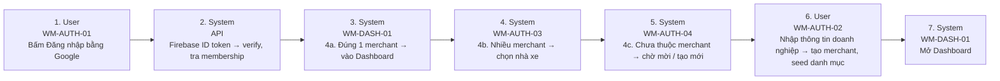

# FLOW-AUTH-MERCHANT — Đăng nhập & onboarding merchant

Nguồn: `doc/2-PRD/06-ui-flow-specs §2` · Mockup: [../mockups/FLOW-AUTH-MERCHANT.html](../mockups/FLOW-AUTH-MERCHANT.html)

| # | Actor | Màn hình | Route | Hành động |
|---:|---|---|---|---|
| 1 | User | API | `` | Bấm Đăng nhập bằng Google |
| 2 | System | API | `` | Firebase ID token → verify, tra membership |
| 3 | System | API | `` | 4a. Đúng 1 merchant → vào Dashboard |
| 4 | System | API | `` | 4b. Nhiều merchant → chọn nhà xe |
| 5 | System | API | `` | 4c. Chưa thuộc merchant → chờ mời / tạo mới |
| 6 | User | API | `` | Nhập thông tin doanh nghiệp → tạo merchant, seed danh mục |
| 7 | System | API | `` | Mở Dashboard |
