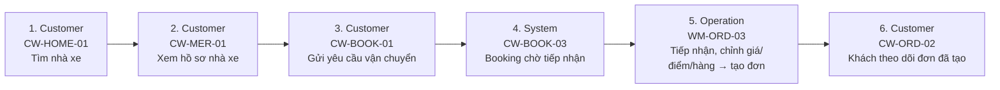

# FLOW-BOOKING-CUSTOMER — Booking khách hàng → đơn (phase 3)

Nguồn: `doc/2-PRD/06-ui-flow-specs §11, 01 §7.6` · Mockup: [../mockups/FLOW-BOOKING-CUSTOMER.html](../mockups/FLOW-BOOKING-CUSTOMER.html)

| # | Actor | Màn hình | Route | Hành động |
|---:|---|---|---|---|
| 1 | Customer | API | `` | Tìm nhà xe |
| 2 | Customer | API | `` | Xem hồ sơ nhà xe |
| 3 | Customer | API | `` | Gửi yêu cầu vận chuyển |
| 4 | System | API | `` | Booking chờ tiếp nhận |
| 5 | Operation | API | `` | Tiếp nhận, chỉnh giá/điểm/hàng → tạo đơn |
| 6 | Customer | API | `` | Khách theo dõi đơn đã tạo |
