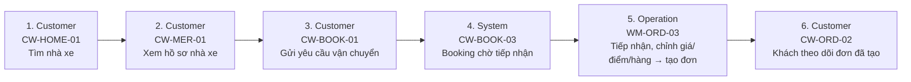

# FLOW-BOOKING-CUSTOMER — Booking khách hàng → đơn (phase 3)

Nguồn: `doc/2-PRD/06-ui-flow-specs §11, 01 §7.6` · Mockup: [../mockups/FLOW-BOOKING-CUSTOMER.html](../mockups/FLOW-BOOKING-CUSTOMER.html)

| # | Actor | Màn hình | Route | Hành động |
|---:|---|---|---|---|
| 1 | Customer | [CW-HOME-01](../screens/cw/CW-HOME-01.md) Trang khám phá | `/` | Tìm nhà xe |
| 2 | Customer | [CW-MER-01](../screens/cw/CW-MER-01.md) Hồ sơ nhà xe | `/merchants/:merchantId` | Xem hồ sơ nhà xe |
| 3 | Customer | [CW-BOOK-01](../screens/cw/CW-BOOK-01.md) Tạo booking/yêu cầu vận chuyển | `/bookings/new` | Gửi yêu cầu vận chuyển |
| 4 | System | [CW-BOOK-03](../screens/cw/CW-BOOK-03.md) Chi tiết booking | `/bookings/:bookingId` | Booking chờ tiếp nhận |
| 5 | Operation | [WM-ORD-03](../screens/wm/WM-ORD-03.md) Tạo/sửa đơn | `/orders/new · /orders/:orderId/edit` | Tiếp nhận, chỉnh giá/điểm/hàng → tạo đơn |
| 6 | Customer | [CW-ORD-02](../screens/cw/CW-ORD-02.md) Chi tiết đơn khách | `/orders/:orderId` | Khách theo dõi đơn đã tạo |
