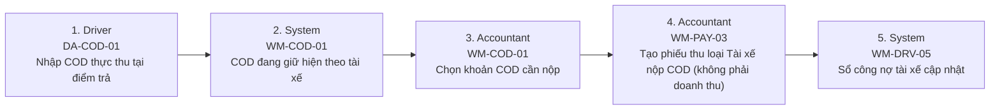

# FLOW-COD-REMITTANCE — COD tài xế: thu tại điểm → nộp lại

Nguồn: `doc/2-PRD/06-ui-flow-specs §8, 01 §7.3` · Mockup: [../mockups/FLOW-COD-REMITTANCE.html](../mockups/FLOW-COD-REMITTANCE.html)

| # | Actor | Màn hình | Route | Hành động |
|---:|---|---|---|---|
| 1 | Driver | [DA-COD-01](../screens/da/DA-COD-01.md) Nhập COD thực thu | `DriverCodInputRoute(stopId)` | Nhập COD thực thu tại điểm trả |
| 2 | System | [WM-COD-01](../screens/wm/WM-COD-01.md) COD tài xế đang giữ | `/finance/cod` | COD đang giữ hiện theo tài xế |
| 3 | Accountant | [WM-COD-01](../screens/wm/WM-COD-01.md) COD tài xế đang giữ | `/finance/cod` | Chọn khoản COD cần nộp |
| 4 | Accountant | [WM-PAY-03](../screens/wm/WM-PAY-03.md) Tạo phiếu thu | `/finance/payments/new` | Tạo phiếu thu loại Tài xế nộp COD (không phải doanh thu) |
| 5 | System | [WM-DRV-05](../screens/wm/WM-DRV-05.md) Sổ công nợ tài xế | `/drivers/:driverId?tab=ledger` | Sổ công nợ tài xế cập nhật |
