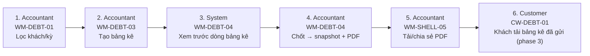

# FLOW-DEBT-STATEMENT — Chốt bảng kê công nợ

Nguồn: `doc/2-PRD/06-ui-flow-specs §9` · Mockup: [../mockups/FLOW-DEBT-STATEMENT.html](../mockups/FLOW-DEBT-STATEMENT.html)

| # | Actor | Màn hình | Route | Hành động |
|---:|---|---|---|---|
| 1 | Accountant | API | `` | Lọc khách/kỳ |
| 2 | Accountant | API | `` | Tạo bảng kê |
| 3 | System | API | `` | Xem trước dòng bảng kê |
| 4 | Accountant | API | `` | Chốt → snapshot + PDF |
| 5 | Accountant | API | `` | Tải/chia sẻ PDF |
| 6 | Customer | API | `` | Khách tải bảng kê đã gửi (phase 3) |
