# FLOW-DRIVER-FIELD — Tài xế: trạng thái, POD, COD (có offline)

Nguồn: `doc/2-PRD/06-ui-flow-specs §6` · Mockup: [../mockups/FLOW-DRIVER-FIELD.html](../mockups/FLOW-DRIVER-FIELD.html)

```mermaid
flowchart LR
  S1["1. Driver<br/>DA-HOME-01<br/>Mở chuyến đang chạy"]
  S2["2. Driver<br/>DA-TRIP-01<br/>Xem điểm, hàng, ghi chú, COD"]
  S1 --> S2
  S3["3. Driver<br/>DA-STATUS-01<br/>Cập nhật: Đang đến điểm lấy"]
  S2 --> S3
  S4["4. Driver<br/>DA-STOP-02<br/>Đã đến / hoàn thành điểm lấy"]
  S3 --> S4
  S5["5. Driver<br/>DA-STATUS-01<br/>Đang vận chuyển → Đang trả hàng"]
  S4 --> S5
  S6["6. Driver<br/>DA-COD-01<br/>Nhập COD thực thu"]
  S5 --> S6
  S7["7. Driver<br/>DA-POD-01<br/>Chụp POD"]
  S6 --> S7
  S8["8. Driver<br/>DA-STOP-02<br/>Hoàn thành điểm trả"]
  S7 --> S8
  S9["9. Driver<br/>DA-SYNC-01<br/>Offline: hàng đợi, thử lại"]
  S8 --> S9
  S10["10. Operation<br/>WM-TRIP-01<br/>Thấy trạng thái, POD, COD"]
  S9 --> S10
```

| # | Actor | Màn hình | Route | Hành động |
|---:|---|---|---|---|
| 1 | Driver | API | `` | Mở chuyến đang chạy |
| 2 | Driver | API | `` | Xem điểm, hàng, ghi chú, COD |
| 3 | Driver | API | `` | Cập nhật: Đang đến điểm lấy |
| 4 | Driver | API | `` | Đã đến / hoàn thành điểm lấy |
| 5 | Driver | API | `` | Đang vận chuyển → Đang trả hàng |
| 6 | Driver | API | `` | Nhập COD thực thu |
| 7 | Driver | API | `` | Chụp POD |
| 8 | Driver | API | `` | Hoàn thành điểm trả |
| 9 | Driver | API | `` | Offline: hàng đợi, thử lại |
| 10 | Operation | API | `` | Thấy trạng thái, POD, COD |
