# FLOW-DRIVER-FIELD — Tài xế: trạng thái, POD, COD (có offline)

Nguồn: `doc/2-PRD/06-ui-flow-specs §6` · Mockup: [../mockups/FLOW-DRIVER-FIELD.html](../mockups/FLOW-DRIVER-FIELD.html)

```mermaid
flowchart LR
  S1["1. Driver<br/>DA-HOME-01<br/>Mở chuyến đang chạy"]
  S2["2. Driver<br/>DA-TRIP-01<br/>Xem điểm, hàng, ghi chú, COD"]
  S1 --> S2
  S3["3. Driver<br/>DA-STATUS-01<br/>Cập nhật: Đang đến điểm lấy"]
  S2 --> S3
  S4["4. Driver<br/>DA-STOP-02<br/>Đã đến / hoàn thành điểm lấy"]
  S3 --> S4
  S5["5. Driver<br/>DA-STATUS-01<br/>Đang vận chuyển → Đang trả hàng"]
  S4 --> S5
  S6["6. Driver<br/>DA-COD-01<br/>Nhập COD thực thu"]
  S5 --> S6
  S7["7. Driver<br/>DA-POD-01<br/>Chụp POD"]
  S6 --> S7
  S8["8. Driver<br/>DA-STOP-02<br/>Hoàn thành điểm trả"]
  S7 --> S8
  S9["9. Driver<br/>DA-SYNC-01<br/>Offline: hàng đợi, thử lại"]
  S8 --> S9
  S10["10. Operation<br/>WM-TRIP-01<br/>Thấy trạng thái, POD, COD"]
  S9 --> S10
```

| # | Actor | Màn hình | Route | Hành động |
|---:|---|---|---|---|
| 1 | Driver | [DA-HOME-01](../screens/da/DA-HOME-01.md) Trang chủ công việc | `DriverHomeRoute` | Mở chuyến đang chạy |
| 2 | Driver | [DA-TRIP-01](../screens/da/DA-TRIP-01.md) Chi tiết chuyến | `DriverTripDetailRoute(tripId)` | Xem điểm, hàng, ghi chú, COD |
| 3 | Driver | [DA-STATUS-01](../screens/da/DA-STATUS-01.md) Cập nhật trạng thái chuyến | `DriverStatusUpdateRoute(tripId)` | Cập nhật: Đang đến điểm lấy |
| 4 | Driver | [DA-STOP-02](../screens/da/DA-STOP-02.md) Chi tiết điểm dừng | `DriverStopDetailRoute(stopId)` | Đã đến / hoàn thành điểm lấy |
| 5 | Driver | [DA-STATUS-01](../screens/da/DA-STATUS-01.md) Cập nhật trạng thái chuyến | `DriverStatusUpdateRoute(tripId)` | Đang vận chuyển → Đang trả hàng |
| 6 | Driver | [DA-COD-01](../screens/da/DA-COD-01.md) Nhập COD thực thu | `DriverCodInputRoute(stopId)` | Nhập COD thực thu |
| 7 | Driver | [DA-POD-01](../screens/da/DA-POD-01.md) Chụp POD | `DriverPodCaptureRoute(stopId)` | Chụp POD |
| 8 | Driver | [DA-STOP-02](../screens/da/DA-STOP-02.md) Chi tiết điểm dừng | `DriverStopDetailRoute(stopId)` | Hoàn thành điểm trả |
| 9 | Driver | [DA-SYNC-01](../screens/da/DA-SYNC-01.md) Đồng bộ offline | `DriverSyncRoute` | Offline: hàng đợi, thử lại |
| 10 | Operation | [WM-TRIP-01](../screens/wm/WM-TRIP-01.md) Chi tiết chuyến | `/trips/:tripId` | Thấy trạng thái, POD, COD |
