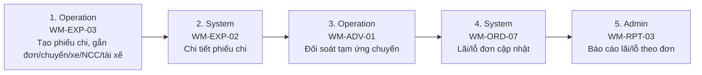

# FLOW-EXPENSE-PROFIT — Chi phí, tạm ứng & lãi/lỗ đơn

Nguồn: `doc/2-PRD/01 §7.4` · Mockup: [../mockups/FLOW-EXPENSE-PROFIT.html](../mockups/FLOW-EXPENSE-PROFIT.html)

| # | Actor | Màn hình | Route | Hành động |
|---:|---|---|---|---|
| 1 | Operation | [WM-EXP-03](../screens/wm/WM-EXP-03.md) Tạo phiếu chi | `/finance/expenses/new` | Tạo phiếu chi, gắn đơn/chuyến/xe/NCC/tài xế |
| 2 | System | [WM-EXP-02](../screens/wm/WM-EXP-02.md) Chi tiết phiếu chi | `/finance/expenses/:expenseId` | Chi tiết phiếu chi |
| 3 | Operation | [WM-ADV-01](../screens/wm/WM-ADV-01.md) Tạm ứng chuyến & đối soát | `/finance/trip-advances` | Đối soát tạm ứng chuyến |
| 4 | System | API | `` | Lãi/lỗ đơn cập nhật |
| 5 | Admin | API | `` | Báo cáo lãi/lỗ theo đơn |
