# FLOW-MASTER-DATA — CRUD dữ liệu nền (khách, tài xế, xe, NCC)

Nguồn: `doc/2-PRD/06-ui-flow-specs §3` · Mockup: [../mockups/FLOW-MASTER-DATA.html](../mockups/FLOW-MASTER-DATA.html)

```mermaid
flowchart LR
  S1["1. User<br/>WM-CUS-01<br/>Tìm/lọc, bấm Tạo"]
  S2["2. User<br/>WM-CUS-03<br/>Nhập field bắt buộc, lưu"]
  S1 --> S2
  S3["3. System<br/>WM-CUS-02<br/>Mở chi tiết vừa tạo"]
  S2 --> S3
  S4["4. User<br/>WM-CUS-04<br/>Thêm địa chỉ/liên hệ"]
  S3 --> S4
  S5["5. User<br/>WM-DRV-03<br/>Tạo tài xế + tài khoản app"]
  S4 --> S5
  S6["6. User<br/>WM-DRV-04<br/>Thêm mốc lương cố định"]
  S5 --> S6
  S7["7. User<br/>WM-VEH-03<br/>Tạo xe (biển số duy nhất)"]
  S6 --> S7
  S8["8. User<br/>WM-SUP-03<br/>Tạo NCC"]
  S7 --> S8
  S9["9. User<br/>WM-SHELL-04<br/>Hoặc import Excel"]
  S8 --> S9
```

| # | Actor | Màn hình | Route | Hành động |
|---:|---|---|---|---|
| 1 | User | API | `` | Tìm/lọc, bấm Tạo |
| 2 | User | API | `` | Nhập field bắt buộc, lưu |
| 3 | System | API | `` | Mở chi tiết vừa tạo |
| 4 | User | API | `` | Thêm địa chỉ/liên hệ |
| 5 | User | API | `` | Tạo tài xế + tài khoản app |
| 6 | User | API | `` | Thêm mốc lương cố định |
| 7 | User | API | `` | Tạo xe (biển số duy nhất) |
| 8 | User | API | `` | Tạo NCC |
| 9 | User | API | `` | Hoặc import Excel |
