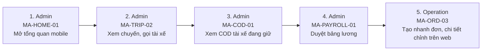

# FLOW-MERCHANT-MOBILE — App Merchant: theo dõi & duyệt nhanh (phase 2)

Nguồn: `doc/2-PRD/01 §5` · Mockup: [../mockups/FLOW-MERCHANT-MOBILE.html](../mockups/FLOW-MERCHANT-MOBILE.html)

| # | Actor | Màn hình | Route | Hành động |
|---:|---|---|---|---|
| 1 | Admin | [MA-HOME-01](../screens/ma/MA-HOME-01.md) Tổng quan mobile | `MerchantHomeRoute` | Mở tổng quan mobile |
| 2 | Admin | [MA-TRIP-02](../screens/ma/MA-TRIP-02.md) Chi tiết chuyến | `MerchantTripDetailRoute(tripId)` | Xem chuyến, gọi tài xế |
| 3 | Admin | [MA-COD-01](../screens/ma/MA-COD-01.md) COD tài xế | `MerchantCodRoute` | Xem COD tài xế đang giữ |
| 4 | Admin | [MA-PAYROLL-01](../screens/ma/MA-PAYROLL-01.md) Duyệt bảng lương | `MerchantPayrollApprovalRoute` | Duyệt bảng lương |
| 5 | Operation | [MA-ORD-03](../screens/ma/MA-ORD-03.md) Tạo nhanh đơn | `MerchantQuickOrderCreateRoute` | Tạo nhanh đơn, chi tiết chỉnh trên web |
