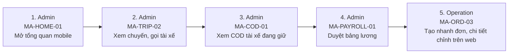

# FLOW-MERCHANT-MOBILE — App Merchant: theo dõi & duyệt nhanh (phase 2)

Nguồn: `doc/2-PRD/01 §5` · Mockup: [../mockups/FLOW-MERCHANT-MOBILE.html](../mockups/FLOW-MERCHANT-MOBILE.html)

| # | Actor | Màn hình | Route | Hành động |
|---:|---|---|---|---|
| 1 | Admin | API | `` | Mở tổng quan mobile |
| 2 | Admin | API | `` | Xem chuyến, gọi tài xế |
| 3 | Admin | API | `` | Xem COD tài xế đang giữ |
| 4 | Admin | API | `` | Duyệt bảng lương |
| 5 | Operation | API | `` | Tạo nhanh đơn, chi tiết chỉnh trên web |
