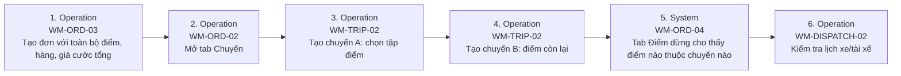

# FLOW-ORDER-MULTI-TRUCK — Đơn nhiều xe

Nguồn: `doc/2-PRD/06-ui-flow-specs §5` · Mockup: [../mockups/FLOW-ORDER-MULTI-TRUCK.html](../mockups/FLOW-ORDER-MULTI-TRUCK.html)

| # | Actor | Màn hình | Route | Hành động |
|---:|---|---|---|---|
| 1 | Operation | API | `` | Tạo đơn với toàn bộ điểm, hàng, giá cước tổng |
| 2 | Operation | API | `` | Mở tab Chuyến |
| 3 | Operation | [WM-TRIP-02](../screens/wm/WM-TRIP-02.md) Tạo/sửa chuyến | `/orders/:orderId/trips/new · /trips/:tripId/edit` | Tạo chuyến A: chọn tập điểm |
| 4 | Operation | [WM-TRIP-02](../screens/wm/WM-TRIP-02.md) Tạo/sửa chuyến | `/orders/:orderId/trips/new · /trips/:tripId/edit` | Tạo chuyến B: điểm còn lại |
| 5 | System | API | `` | Tab Điểm dừng cho thấy điểm nào thuộc chuyến nào |
| 6 | Operation | [WM-DISPATCH-02](../screens/wm/WM-DISPATCH-02.md) Lịch xe/tài xế | `/dispatch/calendar` | Kiểm tra lịch xe/tài xế |
