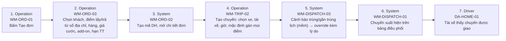

# FLOW-ORDER-ONE-TRUCK — Tạo đơn 1 xe nhanh → điều phối → tài xế

Nguồn: `doc/2-PRD/06-ui-flow-specs §4, 01 §7.1` · Mockup: [../mockups/FLOW-ORDER-ONE-TRUCK.html](../mockups/FLOW-ORDER-ONE-TRUCK.html)

| # | Actor | Màn hình | Route | Hành động |
|---:|---|---|---|---|
| 1 | Operation | API | `` | Bấm Tạo đơn |
| 2 | Operation | API | `` | Chọn khách, điểm lấy/trả từ sổ địa chỉ, hàng, giá cước, add-on, hạn TT |
| 3 | System | API | `` | Tạo mã DH, mở chi tiết đơn |
| 4 | Operation | API | `` | Tạo chuyến: chọn xe, tài xế, giờ; mặc định gán mọi điểm |
| 5 | System | API | `` | Cảnh báo trùng/gần trùng lịch (mềm) → override kèm lý do |
| 6 | System | API | `` | Chuyến xuất hiện trên bảng điều phối |
| 7 | Driver | API | `` | Tài xế thấy chuyến được giao |
