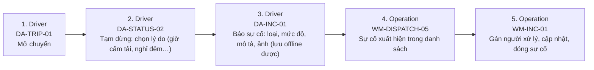

# FLOW-PAUSE-INCIDENT — Tạm dừng chuyến & báo sự cố

Nguồn: `doc/2-PRD/03-driver-app-ui §10, 01 §3.9` · Mockup: [../mockups/FLOW-PAUSE-INCIDENT.html](../mockups/FLOW-PAUSE-INCIDENT.html)

| # | Actor | Màn hình | Route | Hành động |
|---:|---|---|---|---|
| 1 | Driver | [DA-TRIP-01](../screens/da/DA-TRIP-01.md) Chi tiết chuyến | `DriverTripDetailRoute(tripId)` | Mở chuyến |
| 2 | Driver | [DA-STATUS-02](../screens/da/DA-STATUS-02.md) Tạm dừng chuyến | `DriverPauseTripRoute(tripId)` | Tạm dừng: chọn lý do (giờ cấm tải, nghỉ đêm…) |
| 3 | Driver | [DA-INC-01](../screens/da/DA-INC-01.md) Báo sự cố | `DriverIncidentReportRoute(tripId)` | Báo sự cố: loại, mức độ, mô tả, ảnh (lưu offline được) |
| 4 | Operation | API | `` | Sự cố xuất hiện trong danh sách |
| 5 | Operation | API | `` | Gán người xử lý, cập nhật, đóng sự cố |
