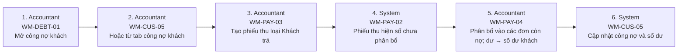

# FLOW-PAYMENT-ALLOCATION — Khách thanh toán & phân bổ

Nguồn: `doc/2-PRD/06-ui-flow-specs §7, 01 §7.2` · Mockup: [../mockups/FLOW-PAYMENT-ALLOCATION.html](../mockups/FLOW-PAYMENT-ALLOCATION.html)

| # | Actor | Màn hình | Route | Hành động |
|---:|---|---|---|---|
| 1 | Accountant | API | `` | Mở công nợ khách |
| 2 | Accountant | API | `` | Hoặc từ tab công nợ khách |
| 3 | Accountant | API | `` | Tạo phiếu thu loại Khách trả |
| 4 | System | API | `` | Phiếu thu hiện số chưa phân bổ |
| 5 | Accountant | API | `` | Phân bổ vào các đơn còn nợ; dư → số dư khách |
| 6 | System | API | `` | Cập nhật công nợ và số dư |
