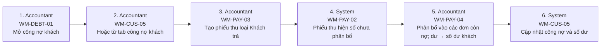

# FLOW-PAYMENT-ALLOCATION — Khách thanh toán & phân bổ

Nguồn: `doc/2-PRD/06-ui-flow-specs §7, 01 §7.2` · Mockup: [../mockups/FLOW-PAYMENT-ALLOCATION.html](../mockups/FLOW-PAYMENT-ALLOCATION.html)

| # | Actor | Màn hình | Route | Hành động |
|---:|---|---|---|---|
| 1 | Accountant | [WM-DEBT-01](../screens/wm/WM-DEBT-01.md) Công nợ khách tổng hợp | `/finance/customer-debt` | Mở công nợ khách |
| 2 | Accountant | API | `` | Hoặc từ tab công nợ khách |
| 3 | Accountant | [WM-PAY-03](../screens/wm/WM-PAY-03.md) Tạo phiếu thu | `/finance/payments/new` | Tạo phiếu thu loại Khách trả |
| 4 | System | [WM-PAY-02](../screens/wm/WM-PAY-02.md) Chi tiết phiếu thu | `/finance/payments/:paymentId` | Phiếu thu hiện số chưa phân bổ |
| 5 | Accountant | [WM-PAY-04](../screens/wm/WM-PAY-04.md) Phân bổ payment | `/finance/payments/:paymentId/allocate` | Phân bổ vào các đơn còn nợ; dư → số dư khách |
| 6 | System | API | `` | Cập nhật công nợ và số dư |
