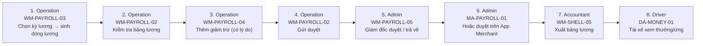

# FLOW-PAYROLL — Tạo & duyệt bảng lương

Nguồn: `doc/2-PRD/06-ui-flow-specs §10, 01 §7.5` · Mockup: [../mockups/FLOW-PAYROLL.html](../mockups/FLOW-PAYROLL.html)

| # | Actor | Màn hình | Route | Hành động |
|---:|---|---|---|---|
| 1 | Operation | [WM-PAYROLL-03](../screens/wm/WM-PAYROLL-03.md) Tạo bảng lương | `/payroll/new` | Chọn kỳ lương → sinh dòng lương |
| 2 | Operation | [WM-PAYROLL-02](../screens/wm/WM-PAYROLL-02.md) Chi tiết bảng lương | `/payroll/:payrollId` | Kiểm tra bảng lương |
| 3 | Operation | [WM-PAYROLL-04](../screens/wm/WM-PAYROLL-04.md) Chi tiết dòng lương tài xế | `/payroll/:payrollId/lines/:lineId` | Thêm giảm trừ (có lý do) |
| 4 | Operation | [WM-PAYROLL-02](../screens/wm/WM-PAYROLL-02.md) Chi tiết bảng lương | `/payroll/:payrollId` | Gửi duyệt |
| 5 | Admin | [WM-PAYROLL-05](../screens/wm/WM-PAYROLL-05.md) Duyệt bảng lương | `/payroll/:payrollId/approve` | Giám đốc duyệt / trả về |
| 6 | Admin | API | `` | Hoặc duyệt trên App Merchant |
| 7 | Accountant | API | `` | Xuất bảng lương |
| 8 | Driver | API | `` | Tài xế xem thưởng/ứng |
