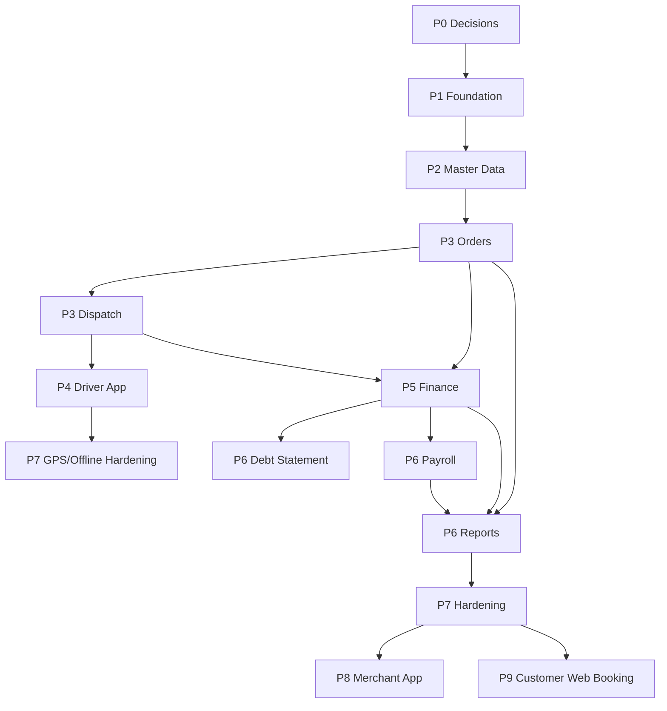

# PRD — Implementation Breakdown cho tất cả platform

> Nguồn: toàn bộ `doc/1-BRD`, `doc/2-PRD`, `doc/3-TECHNICAL`, `doc/4-DESIGN`.
> Ngày lập: 2026-09-23
> Mục tiêu: chia nhỏ toàn bộ sản phẩm BTA thành task/user story đủ cụ thể để giao cho Claude Code implement, có phase, dependency, thứ tự trước/sau và khả năng chạy song song.
> Phạm vi bao phủ: **backend/API/database, Web Merchant, App Tài xế, App Merchant, Web Khách hàng, reports/export/import, design system, QA/hardening**.

## 1. Cách dùng tài liệu này

Tài liệu này là master backlog triển khai. Khi giao task cho Claude Code, nên copy nguyên một task hoặc một nhóm task cùng phase, kèm các file nguồn cần đọc.

Mỗi task có:

- **ID:** mã ổn định để trao đổi và tracking.
- **Story:** user story hoặc mục tiêu triển khai.
- **Scope:** phần cần làm.
- **Depends on:** task phải xong trước.
- **Can run parallel with:** task có thể chạy song song.
- **Acceptance criteria:** điều kiện nghiệm thu.
- **Primary refs:** tài liệu phải đọc trước khi làm.

Nếu codebase đã có một phần implementation, Claude Code phải đọc code hiện tại trước, giữ pattern sẵn có, rồi chỉ bổ sung phần thiếu.

## 2. Nguyên tắc chia task

- **Implementation phải bao phủ tất cả platform.** Backend/API/database là nền dùng chung; Web Merchant và App Tài xế là phase 1; App Merchant là phase 2; Web Khách hàng/booking là phase 3. Không coi backlog là hoàn tất nếu còn platform nào chưa có task.
- **Không build theo màn hình đơn lẻ nếu thiếu nền dữ liệu/API.** Màn hình có thể làm mock trước, nhưng phải tách rõ mock vs API thật.
- **Không làm finance trước order model.** Công nợ, payment allocation, COD, lãi/lỗ đều phụ thuộc order/trip/stop.
- **Không làm payroll trước driver/trip/expense.** Bảng lương cần driver salary history, thưởng trip/order, ứng/giảm trừ.
- **Không làm GPS trước trip + driver auth.** GPS point phải gắn trip, driver và tenant.
- **Không làm report trước công thức nguồn.** Report phải dùng cùng công thức với detail screen/API để tránh lệch số.
- **Web UI và API có thể chạy song song** nếu đã chốt GraphQL contract hoặc dùng mock adapter thay được.
- **Driver App có thể chạy song song Web Merchant** sau khi có driver auth decision và trip/job API contract.
- **Phase 2/3 không chặn Phase 1.** App Merchant và Web Khách hàng chỉ bắt đầu sau khi Phase 1 core ổn.

## 3. Phase tổng thể

| Phase | Tên | Mục tiêu | Platform chính | Có thể go-live? |
|---|---|---|---|---|
| P0 | Quyết định mở + baseline | Chốt open decisions và audit repo | All | Chưa |
| P1 | Foundation SaaS | Auth, tenant, RBAC, DB base, audit, numbering, design system | Backend, Web, Driver App | Chưa |
| P2 | Master Data | Merchant settings, nhân viên, khách, tài xế, xe, NCC, địa chỉ | Backend, Web | Nội bộ được |
| P3 | Order + Dispatch Web MVP | Order, stop, cargo, add-on, trip, điều phối, status/history | Backend, Web | Có thể chạy operation nội bộ |
| P4 | Driver App MVP | Tài xế xem việc, cập nhật status, POD, COD, sync tối thiểu | Backend, Driver App, Web observe | Go-live vận hành cơ bản |
| P5 | Finance + Debt + COD | Thu chi, phân bổ, công nợ khách/NCC/tài xế, COD warning | Backend, Web, Driver App COD data | Go-live tài chính cơ bản |
| P6 | Payroll + Reports + Export | Bảng lương, duyệt, PDF bảng kê, Excel, dashboard/report | Backend, Web | Go-live quản trị/kế toán |
| P7 | Hardening Phase 1 | Import, notification, incident dashboard, indexes, E2E | Backend, Web, Driver App | Production-ready hơn |
| P8 | App Merchant | Mobile cho chủ/operation/kế toán | Backend, App Merchant | Phase 2 |
| P9 | Web Khách hàng + Booking | Customer portal, booking online | Backend, Web Khách hàng, Web Merchant bridge | Phase 3 |

## 4. Coverage theo platform

| Platform | Phạm vi implementation | Phase chính | Điều kiện xem là hoàn tất |
|---|---|---|---|
| Backend/API/Database | NestJS GraphQL, REST upload/GPS, Prisma/PostgreSQL, auth, tenant, RBAC, audit, numbering, domain modules, reports/export/import | P1-P9 | Tất cả business flow có API thật, tenant-safe, có audit/permission, migration/seed/test phù hợp |
| Web Merchant | React + Vite, shell, dashboard, master data, order/dispatch, finance, payroll, reports, settings, import/export | P1-P7 | Operation/kế toán/giám đốc thao tác được toàn bộ phase 1 trên web |
| App Tài xế | Flutter, login, job list, trip/stop detail, status, POD, COD, incident, GPS, offline sync | P4-P7 | Tài xế xử lý chuyến ngoài hiện trường mà không cần web |
| App Merchant | Mobile cho chủ/operation/kế toán: dashboard, order/trip monitoring, finance quick view, payroll approval | P8 | Chủ/operation/kế toán xem và xử lý nhanh trên mobile theo scope phase 2 |
| Web Khách hàng | Customer auth, discovery, merchant profile, booking request, order history, debt statement visibility | P9 | Khách tạo booking và theo dõi lịch sử/order/bảng kê theo scope phase 3 |
| Design system/UI | Web component system, Flutter widget system, UX states, responsive, permission states | P1-P8 | Các platform dùng chung ngôn ngữ thiết kế, không lệch pattern nghiệp vụ |
| QA/Operations | E2E, seed data, CI, indexes, backup checklist, monitoring basics | P7 | Có regression coverage cho critical path và checklist vận hành production |

## 5. Workstream song song

| Stream | Chủ đề | Có thể bắt đầu khi | Ghi chú song song |
|---|---|---|---|
| S1 | API/DB foundation | P0 decisions xong | Chặn hầu hết backend domain |
| S2 | Web design system + shell | Repo/web build chạy được | Có thể mock data trong khi API chưa xong |
| S3 | Web master data screens | Design system + API contract master data | Có thể chạy song song backend master data |
| S4 | Order/dispatch backend | DB/auth/tenant/audit base | Chặn finance, driver app real integration |
| S5 | Order/dispatch web | Web shell + order API contract | Có thể mock trước rồi nối API |
| S6 | Driver app UI/offline | Flutter baseline + API contract | Có thể mock song song S4/S5 |
| S7 | Finance backend/web | Order totals + payment/expense schema | Chạy sau P3 core |
| S8 | Payroll/report/export | Finance + driver/trip data | Chạy sau P5 core |
| S9 | App Merchant | Phase 1 APIs stable | Không chặn Phase 1 |
| S10 | Web Khách hàng/booking | Booking model + customer auth decision | Không chặn Phase 1/2 |
| S11 | QA/E2E/performance | Từng flow đủ API + UI | Chạy lặp cuối mỗi phase |

## 6. Dependency map cấp cao



## 7. P0 — Quyết định mở và baseline

### P0-001 — Chốt open decisions phase 1

- **Story:** Là product owner, tôi cần các quyết định mở được chốt để dev không tự đoán khi implement.
- **Scope:** driver auth, job queue, hosting dev/prod, GPS retention, quy tắc sửa bảng lương sau duyệt.
- **Depends on:** Không.
- **Can run parallel with:** P0-002.
- **Acceptance criteria:** Decision log/PRD được cập nhật; không còn task backend/mobile bị block bởi 5 quyết định này.
- **Primary refs:** `doc/3-TECHNICAL/ARCHITECTURE.md` mục Open Decisions.

### P0-002 — Audit repo hiện tại và xác định baseline

- **Story:** Là dev lead, tôi cần biết repo hiện đang có gì để không scaffold trùng hoặc ghi đè code đang có.
- **Scope:** kiểm tra apps/packages, Nx config, package manager, scripts build/test/lint, phần đã xong/lệch docs.
- **Depends on:** Không.
- **Can run parallel with:** P0-001.
- **Acceptance criteria:** Có checklist baseline; không xóa/revert thay đổi ngoài scope.
- **Primary refs:** `doc/3-TECHNICAL/ARCHITECTURE.md`, repo root.

### P0-003 — Chuẩn hóa task handoff format cho Claude Code

- **Story:** Là team lead, tôi cần format giao việc thống nhất để nhiều Claude Code session không đạp nhau.
- **Scope:** template prompt task, branch naming, module ownership, non-goals, test expectation.
- **Depends on:** P0-002.
- **Can run parallel with:** P1 design docs cleanup.
- **Acceptance criteria:** Có template dùng được cho mọi task trong file này.
- **Primary refs:** `doc/4-DESIGN/04-claude-code-handoff.md`.

## 8. P1 — Foundation SaaS

### FDN-001 — Nx workspace và shared config

- **Story:** Là developer, tôi cần monorepo build/test/lint ổn định để các app/package cùng phát triển.
- **Scope:** verify/tạo Nx workspace, shared tsconfig/eslint/prettier, scripts build/test/lint, dev ports API 2001/Web 2002.
- **Depends on:** P0-002.
- **Can run parallel with:** WEB-DS-001 nếu web baseline chạy được.
- **Acceptance criteria:** API/web/shared packages build; dev scripts rõ.
- **Primary refs:** `doc/1-BRD/08-kien-truc.md`, `doc/3-TECHNICAL/ARCHITECTURE.md`.

### FDN-002 — Shared domain constants và validation base

- **Story:** Là developer, tôi cần status/role/permission/type dùng chung để API, web và app không lệch nhau.
- **Scope:** order/trip/stop status, payment/expense/payroll/debt statement status/type, role/permission constants, money/date helpers, zod base.
- **Depends on:** FDN-001.
- **Can run parallel with:** WEB-DS-001, FLT-DS-001.
- **Acceptance criteria:** API/web/mobile packages dùng shared constants; không hard-code duplicate status trong module mới.
- **Primary refs:** `doc/1-BRD/02-nghiep-vu-don-hang.md`, `doc/1-BRD/07-data-model.md`.

### FDN-003 — Prisma schema foundation

- **Story:** Là backend dev, tôi cần schema nền đủ cho multi-tenant, audit, numbering, attachment để các domain xây trên đó.
- **Scope:** merchant, user, roles/permissions, driver_accounts, number_sequences, audit/status history, attachment metadata, catalog, migration + seed.
- **Depends on:** FDN-001, FDN-002.
- **Can run parallel with:** WEB-DS-001.
- **Acceptance criteria:** Migration chạy được; seed tạo merchant demo/roles/catalog defaults; entity nghiệp vụ có `merchant_id`.
- **Primary refs:** `doc/1-BRD/07-data-model.md`, `doc/3-TECHNICAL/ARCHITECTURE.md`.

### FDN-004 — API auth, tenant context và Prisma tenant guard

- **Story:** Là merchant user, tôi chỉ được truy cập dữ liệu merchant của mình.
- **Scope:** verify Firebase ID token, map user -> merchant/role, request context, repository/Prisma tenant enforcement.
- **Depends on:** FDN-003.
- **Can run parallel with:** WEB-DS-001.
- **Acceptance criteria:** Query nghiệp vụ không cross-tenant; resolver nhận principal đúng; có test hoặc seed chứng minh tenant isolation.
- **Primary refs:** `doc/1-BRD/01-decisions.md` D-001/D-006.

### FDN-005 — RBAC và sensitive permission service

- **Story:** Là admin, tôi muốn kiểm soát ai được sửa dữ liệu nhạy cảm và mọi override phải có lý do.
- **Scope:** role admin/operation/kế toán/driver, permission constants, backend guard/decorator, required reason helper.
- **Depends on:** FDN-004.
- **Can run parallel with:** FDN-006.
- **Acceptance criteria:** Sensitive action kiểm tra permission; thiếu lý do thì reject; audit log ghi action.
- **Primary refs:** `doc/1-BRD/09-bo-sung-chuc-nang.md`, `doc/2-PRD/01-danh-sach-man-hinh.md` WM-SHELL-08.

### FDN-006 — Numbering service

- **Story:** Là operation/kế toán, tôi cần mã tự động cho chứng từ để đối chiếu nhanh.
- **Scope:** sinh mã theo merchant + document type + tháng/năm; default DH/CX/PT/PC/BL/CN; chống race condition.
- **Depends on:** FDN-003.
- **Can run parallel with:** FDN-005, FDN-007.
- **Acceptance criteria:** Tạo đồng thời không trùng mã; mã tách theo merchant.
- **Primary refs:** `doc/1-BRD/09-bo-sung-chuc-nang.md` 2.1.

### FDN-007 — Audit, status history và timeline API

- **Story:** Là operation/kế toán, tôi cần xem ai đã thay đổi dữ liệu, khi nào và lý do gì.
- **Scope:** activity log service, status history service, timeline query theo entity, helper dùng chung.
- **Depends on:** FDN-003, FDN-004.
- **Can run parallel with:** FDN-006.
- **Acceptance criteria:** Tạo/sửa/hủy/status update có log; web query được timeline drawer.
- **Primary refs:** `doc/1-BRD/09-bo-sung-chuc-nang.md` 2.2.

### FDN-008 — Attachment upload foundation

- **Story:** Là user, tôi cần upload POD/chứng từ/sự cố vào đúng entity.
- **Scope:** presigned upload endpoint, attachment metadata API, link entity_type/entity_id, MinIO/S3 config.
- **Depends on:** FDN-003, FDN-004.
- **Can run parallel with:** WEB-DS-002.
- **Acceptance criteria:** Upload file demo và xem metadata; tenant/permission được kiểm tra.
- **Primary refs:** `doc/1-BRD/09-bo-sung-chuc-nang.md` 2.3.

### WEB-DS-001 — Web design system foundation

- **Story:** Là web dev, tôi cần component nền để build màn hình nghiệp vụ nhất quán.
- **Scope:** theme tokens, app shell, sidebar/topbar, StatusBadge, MoneyCell, DataTable, FilterBar, PageHeader, states.
- **Depends on:** FDN-001 hoặc web baseline chạy được.
- **Can run parallel with:** FDN-003/004/005.
- **Acceptance criteria:** Có demo/màn hình dùng component; không dùng gradient/orb/landing hero; table tiền align right.
- **Primary refs:** `doc/4-DESIGN/00-product-design-principles.md`, `doc/4-DESIGN/01-design-system.md`, `doc/4-DESIGN/02-web-merchant-ui.md`.

### WEB-DS-002 — Shared web interaction components

- **Story:** Là web dev, tôi cần các component dùng chung cho nghiệp vụ tiền và audit.
- **Scope:** EntityPicker, TimelineDrawer, AttachmentUploader/Viewer, SensitiveActionModal, WarningPanel, ImportWizard shell, Export/Print preview shell.
- **Depends on:** WEB-DS-001.
- **Can run parallel with:** P2 backend master data.
- **Acceptance criteria:** Component có mock data/props rõ; nhúng được vào order/customer/finance.
- **Primary refs:** `doc/2-PRD/01-danh-sach-man-hinh.md` section component dùng chung.

### FLT-DS-001 — Flutter design foundation

- **Story:** Là mobile dev, tôi cần theme/widget nền để app tài xế thao tác nhanh ngoài hiện trường.
- **Scope:** theme tokens, app shell/bottom nav, StatusBadge, TripCard, StopCard, MoneyText, PrimaryBottomAction, ReasonBottomSheet, OfflineBanner, SyncStatusChip.
- **Depends on:** P0-002, FDN-002.
- **Can run parallel with:** WEB-DS-001, backend foundation.
- **Acceptance criteria:** Demo Home/Trip/Stop dùng widgets; nút chính rõ, dễ thao tác.
- **Primary refs:** `doc/4-DESIGN/03-driver-app-ui.md`.

## 9. P2 — Master Data

| ID | Story | Scope chính | Depends on | Parallel |
|---|---|---|---|---|
| MD-001 | Admin cấu hình vận hành merchant | Merchant settings API/UI: kỳ lương, ngưỡng overlap, ngưỡng COD, catalog defaults | FDN-004, WEB-DS-001 | MD-002..007 |
| MD-002 | Admin quản lý nhân viên/role | User list/detail/create, role assign, invite placeholder, RBAC UI | FDN-004, FDN-005 | MD-003..007 |
| MD-003 | Operation quản lý khách hàng và địa chỉ | Customer CRUD, hạn mức nợ, ngày công nợ mặc định, customer_location CRUD, detail tabs | FDN-004, FDN-007, WEB-DS-002 | MD-004..007 |
| MD-004 | Operation quản lý tài xế | Driver CRUD, salary history, driver account base, ledger placeholders | FDN-004, P0-001 driver auth | MD-003/005/006 |
| MD-005 | Operation quản lý xe | Vehicle CRUD, status, type/load fields, detail tabs | FDN-004, WEB-DS-001 | MD-003/004/006 |
| MD-006 | Kế toán/operation quản lý NCC | Supplier CRUD, supplier type, detail tabs | FDN-004, WEB-DS-001 | MD-003/004/005 |
| MD-007 | Admin quản lý danh mục | Generic catalog API/UI, seed defaults, active/inactive | FDN-003, FDN-004 | MD screens |

Acceptance chung P2:

- List/detail/create/edit hoạt động cho từng entity.
- Mọi query theo tenant.
- Có loading/empty/error states.
- Dữ liệu master có thể chọn ở order/trip/finance task sau.

Primary refs: `WM-CUS-*`, `WM-DRV-*`, `WM-VEH-*`, `WM-SUP-*`, `WM-CAT-01`, `doc/2-PRD/01-danh-sach-man-hinh.md`.

## 10. P3 — Order + Dispatch Web MVP

| ID | Story | Scope chính | Depends on | Parallel |
|---|---|---|---|---|
| ORD-001 | Operation tạo order lõi | Order entity/API, mã tự động, customer link, status, freight amount, due date, notes | FDN-006, MD-003 | ORD-002 after contract |
| ORD-002 | Operation nhập stops/cargo/add-ons | Order stops, cargo_line, order_addon, stop status, COD expected | ORD-001, MD-007 | ORD-003 |
| ORD-003 | Web order list/create/detail | `WM-ORD-01/02/03`, tabs, search/filter, timeline/chứng từ placeholder | WEB-DS-002, ORD-001/002 | DIS backend |
| DIS-001 | Operation tạo trip | Trip, trip_stop_assign, vehicle/driver assignment, planned time, driver bonus | ORD-002, MD-004, MD-005 | DIS-003 after contract |
| DIS-002 | Warning overlap/gần-overlap | Detect overlap by vehicle/driver, merchant threshold, warning response | DIS-001, MD-001 | DIS-003 |
| DIS-003 | Web trip/dispatch | `WM-TRIP-01/02`, `WM-DISPATCH-01`, assignment warning UI | WEB-DS-002, DIS-001/002 | DIS-004 |
| DIS-004 | Status update service | Order/trip/stop status use case, reason, pause previous state, status history | ORD-002, DIS-001, FDN-007 | DIS-003, Driver API |
| DIS-005 | Incident basic | Incident model/API/UI basic, attach files, status xử lý | FDN-008, ORD-001, DIS-001, MD-007 | Driver incident |
| DIS-006 | External transport info | NCC/chành, xe ngoài, tài xế ngoài, phone, notes, link order/trip | ORD-001, DIS-001, MD-006 | Finance later |

Acceptance chung P3:

- Operation tạo được order 1 xe nhanh và order nhiều xe.
- Order detail thấy stops/cargo/add-ons/trips/timeline/chứng từ.
- Trip gán xe/tài xế có warning mềm, không chặn nếu user có quyền.
- Status update ghi history và audit.

Primary refs: `doc/1-BRD/02-nghiep-vu-don-hang.md`, `doc/1-BRD/05-nghiep-vu-dieu-phoi.md`, `WM-ORD-*`, `WM-TRIP-*`.

## 11. P4 — Driver App MVP

| ID | Story | Scope chính | Depends on | Parallel |
|---|---|---|---|---|
| DRV-API-001 | Tài xế đăng nhập và xem chuyến của mình | Driver auth/session, driver context, job list/detail GraphQL | P0-001, MD-004, DIS-001 | DRV UI mock |
| DRV-UI-001 | Tài xế thấy việc hôm nay | Splash, login, home, job list/calendar basic, notification placeholder | FLT-DS-001, DRV-API contract | DRV-UI-002 |
| DRV-UI-002 | Tài xế xem chi tiết chuyến/stop | Trip detail, stop list/detail, contact, route action, cargo, COD expected | DRV-UI-001, ORD/DIS APIs | DRV-ACT-001 |
| DRV-ACT-001 | Tài xế cập nhật status | Mobile status UI, reason sheet, mutation, offline queue shell | DIS-004, DRV-UI-002 | POD/COD |
| DRV-ACT-002 | Tài xế chụp POD | Camera/gallery, presigned upload, attach to stop, retry state | FDN-008, DRV-UI-002 | COD |
| DRV-ACT-003 | Tài xế nhập COD | COD input UI, update stop cod_actual, edit reason/audit | ORD-002, FDN-005/007, DRV-UI-002 | POD |
| DRV-ACT-004 | Tài xế báo sự cố | Incident report UI, attach images, sync to Web incident | DIS-005, FDN-008, DRV-UI-002 | GPS |
| GPS-001 | Backend nhận GPS batch | REST endpoint, trip_location, validate driver owns trip, idempotency | DRV-API-001, DIS-001 | GPS UI |
| GPS-002 | App gửi GPS | Permission UX, tracking when trip running, local buffer, batch sender | GPS-001, DRV-ACT-001 | Web location |
| GPS-003 | Web xem last known location | Dispatch location list/simple map, latest point, link trip | GPS-001, DIS-003 | Finance |

Acceptance chung P4:

- Tài xế xử lý chuyến ngoài hiện trường: xem việc, update status, POD, COD, báo sự cố.
- Web Merchant quan sát được status/POD/COD từ app.
- Offline/sync tối thiểu có queue và retry.
- GPS chỉ gửi khi có chuyến đang chạy.

Primary refs: `DA-*` trong `doc/2-PRD/01-danh-sach-man-hinh.md`, `doc/4-DESIGN/03-driver-app-ui.md`.

## 12. P5 — Finance + Debt + COD

| ID | Story | Scope chính | Depends on | Parallel |
|---|---|---|---|---|
| FIN-001 | Kế toán ghi phiếu chi/expense | Expense types, paid/unpaid, entity links, paid_by, reimbursable, attachments, list/detail/create | ORD/DIS, MD-004/005/006/007 | FIN-002 |
| FIN-002 | Kế toán ghi phiếu thu | Payment_in customer/driver COD/other, list/detail/create, attachments | MD-003/004, FDN-005 | FIN-001 |
| FIN-003 | Kế toán phân bổ payment | Allocation UI/API, open debt orders, validation, customer credit | FIN-002, ORD-001/002 | FIN-004 |
| FIN-004 | Kế toán xem công nợ khách | Debt queries, overdue days, credit, limit warning, customer debt screen | FIN-003, MD-003 | FIN-005/006 |
| FIN-005 | Kế toán xem công nợ NCC | Supplier debt query/screen, expense links, mark paid flow | FIN-001, MD-006 | FIN-004/006 |
| FIN-006 | Operation/kế toán xem ledger tài xế/COD | Driver ledger, COD held, reimbursable expenses, wage advance visibility, warning thresholds | DRV-ACT-003, FIN-001/002, MD-001 | FIN-007 |
| FIN-007 | Kế toán đối soát tạm ứng chuyến | Advance expense type, reconciliation screen, driver returns/receives | FIN-001/002, DIS-001 | Debt statement |
| FIN-008 | Giám đốc xem lãi/lỗ order | Revenue/cost/profit formula, order finance tab, report source | ORD-002, FIN-001 | Reports |

Acceptance chung P5:

- Không nhầm doanh thu với phiếu thu.
- Tiền tài xế nộp COD là thu hồi phải thu, không tính doanh thu.
- Customer debt/credit, supplier debt, driver ledger tính từ dữ liệu gốc.
- Sensitive edit tiền/COD có permission + reason + audit.

Primary refs: `doc/1-BRD/03-nghiep-vu-cong-no.md`, `doc/1-BRD/04-nghiep-vu-luong-tai-xe.md`, `WM-FIN-*`, `WM-COD-01`.

## 13. P6 — Payroll, Reports, PDF/Excel

| ID | Story | Scope chính | Depends on | Parallel |
|---|---|---|---|---|
| PAY-001 | Operation tạo bảng lương | Payroll model/API, period selection, generate lines from salary history/trip bonus/advances/deductions | MD-001/004, DIS-001, FIN-001 | Reports |
| PAY-002 | Giám đốc duyệt bảng lương | Status draft/submitted/approved/paid/cancelled, admin permission, reason/audit | PAY-001, FDN-005 | Payroll UI |
| PAY-003 | Kế toán xem/export bảng lương | List/detail/line detail, export integration, payslip optional | PAY-001/002, WEB-DS-002 | PDF |
| PDF-001 | Kế toán chốt bảng kê công nợ | debt_statement snapshot, lines, PDF render, status draft/final/sent/cancelled | FIN-004 | Reports |
| RPT-001 | Quản lý xem dashboard | Running trips, overdue debt, COD held, incidents, payroll pending, revenue/cost | DIS-003, FIN-004/006, PAY-002 optional | PDF |
| RPT-002 | Giám đốc/kế toán xem reports | Report center, profit, customer debt, COD, payroll, date filters | FIN-008, FIN-004/006, PAY-003 | Export |
| EXP-001 | Operation/kế toán export Excel | Export orders, debt, payroll, COD held | Relevant list/report APIs | Import |
| IMP-001 | Operation import Excel | Import wizard API/UI, parse, validate preview, commit customer/driver/vehicle | MD-003/004/005, WEB-DS-002 | Export |

Acceptance chung P6:

- Payroll snapshot không đổi ngầm khi dữ liệu gốc thay đổi sau tạo/duyệt.
- Debt statement đã chốt giữ số liệu snapshot.
- Report dùng cùng công thức với detail screens.
- Export/import tenant-safe.

Primary refs: `doc/1-BRD/04-nghiep-vu-luong-tai-xe.md`, `WM-PAYROLL-*`, `WM-DEBT-*`, `WM-RPT-*`.

## 14. P7 — Hardening Phase 1

| ID | Story | Scope chính | Depends on | Parallel |
|---|---|---|---|---|
| HARD-001 | User thấy notification nội bộ | Notification model/API, web bell, driver list, event hooks new trip/debt/COD/payroll/incident | DIS/FIN/PAY events | HARD-002 |
| HARD-002 | Operation quản lý incident tốt hơn | Incident dashboard, filters, assignment, close flow, dashboard warning | DIS-005, DRV-ACT-004 | HARD-001 |
| HARD-003 | Team có E2E regression | Tests for tenant, master data, order→trip→driver POD/COD, payment allocation, payroll approval | P4/P5/P6 core | HARD-004 |
| HARD-004 | Hệ thống chịu dữ liệu vận hành | Indexes, GPS volume policy, soft delete/cancel patterns, backup checklist | Schema mature | HARD-003 |
| HARD-005 | UI state/permission polish | Audit loading/empty/error/no-permission/responsive/sensitive modal across screens | Major UI screens | HARD-003 |

Acceptance chung P7:

- Critical path có test.
- Dashboard/notification/incident vận hành được.
- Main screens có loading/empty/error/no-permission.
- Có checklist backup/restore và indexes cơ bản.

## 15. P8 — App Merchant Phase 2

| ID | Story | Scope chính | Depends on | Parallel |
|---|---|---|---|---|
| MA-001 | Chủ nhà xe/operation đăng nhập app merchant | Auth, mobile shell, home overview, notifications | Phase 1 API stable | CW discovery |
| MA-002 | Chủ/operation xem đơn/chuyến mobile | Order list/detail, trip list/detail, last known location, POD/COD view | MA-001, P3/P4 APIs | MA-003 |
| MA-003 | Giám đốc/kế toán xử lý finance/payroll nhanh | Customer debt summary, COD held, payroll approval | MA-001, P5/P6 APIs | MA-002 |

Acceptance chung P8:

- App Merchant không thay Web Merchant đầy đủ, nhưng xử lý nhanh được dashboard, order/trip, COD, payroll approval.
- Permission/audit áp dụng giống web.
- UI mobile tuân thủ design system, không làm landing/marketing screen.

Primary refs: `MA-*` trong `doc/2-PRD/01-danh-sach-man-hinh.md`.

## 16. P9 — Web Khách hàng + Booking Phase 3

| ID | Story | Scope chính | Depends on | Parallel |
|---|---|---|---|---|
| CW-001 | Khách đăng nhập và quản lý hồ sơ | Customer auth, profile, address book, customer principal | Phase 1 customer model, customer auth decision | CW-002 |
| CW-002 | Khách tìm nhà xe | Discovery list, merchant profile, public merchant config | Merchant public profile | CW-003 |
| CW-003 | Khách gửi booking | Booking create/list/detail, status, Web Merchant convert-to-order flow | CW-001, ORD-001/002 | CW-004 |
| CW-004 | Khách xem lịch sử đơn/bảng kê | Customer order history/detail, statement download if enabled | CW-001, PDF-001 | CW-003 |

Acceptance chung P9:

- Booking không tự thành order; operation tiếp nhận và tạo/chuyển thành order.
- Customer chỉ thấy dữ liệu của chính mình.
- Web Merchant có bridge xử lý booking sang order.

Primary refs: `CW-*` trong `doc/2-PRD/01-danh-sach-man-hinh.md`, `doc/1-BRD/02-nghiep-vu-don-hang.md` mục nguồn đơn.

## 17. Kế hoạch chạy song song theo wave

### Wave 0 — Chuẩn bị

- P0-001 và P0-002 chạy song song.
- Sau P0-002, làm P0-003.

### Wave 1 — Foundation

- API/DB: FDN-001 → FDN-002 → FDN-003 → FDN-004.
- Web: WEB-DS-001 → WEB-DS-002.
- Flutter: FLT-DS-001.
- Sau FDN-004, chạy FDN-005/006/007/008 song song.

### Wave 2 — Master Data

- MD-001 đến MD-007 chạy song song sau foundation.
- Cần thống nhất table/form/detail pattern trước để tránh UI lệch.

### Wave 3 — Core Operation

- Backend: ORD-001 → ORD-002 → DIS-001 → DIS-002/DIS-004/DIS-005/DIS-006.
- Web: ORD-003 và DIS-003 bắt đầu khi contract rõ.
- Driver App: DRV-UI-001/002 có thể mock trước.

### Wave 4 — Driver Field Workflow

- DRV-API-001.
- DRV-ACT-001/002/003/004.
- GPS-001/002/003 cuối wave hoặc sau status running ổn.

### Wave 5 — Finance

- FIN-001 và FIN-002 song song.
- FIN-003 sau payment + order.
- FIN-004/005/006 song song sau base finance.
- FIN-007/008 sau expense.

### Wave 6 — Payroll, PDF, Reports

- PAY-001 → PAY-002 → PAY-003.
- PDF-001 sau FIN-004.
- RPT-001/RPT-002 sau finance/payroll đủ data.
- EXP-001/IMP-001 song song nếu list APIs ổn.

### Wave 7 — Hardening

- HARD-001 đến HARD-005 chạy song song theo module ownership.

### Wave 8 — App Merchant

- MA-001 trước.
- MA-002 và MA-003 song song sau shell/auth.

### Wave 9 — Web Khách hàng

- CW-001 và CW-002 có thể song song sau auth/public profile decision.
- CW-003 và CW-004 sau booking/customer access model.

## 18. Task prompt template cho Claude Code

```text
Bạn implement task <TASK_ID> trong BTA.

Phải đọc trước:
- <primary refs>
- doc/3-TECHNICAL/ARCHITECTURE.md các mục liên quan
- doc/4-DESIGN/* nếu task có UI

Scope:
- <copy scope từ task>

Dependencies đã xong/giả định:
- <list deps>

Non-goals:
- Không implement module ngoài task.
- Không tự đổi business rule trong BRD/PRD.
- Không hard-code tenant hoặc status ngoài shared constants.

Acceptance criteria:
- <copy acceptance criteria>

Yêu cầu kỹ thuật:
- Giữ pattern hiện có trong repo.
- API phải enforce tenant.
- Thao tác nhạy cảm phải permission + reason + audit.
- Tiền VND lưu integer.
- Có loading/empty/error state nếu có UI.
- Chạy test/lint/build phù hợp và báo kết quả.
```

## 19. Definition of Done chung cho task

Một task được coi là xong khi:

- Code chạy qua lint/typecheck/test phù hợp hoặc nêu rõ lý do không chạy được.
- Migration/seed đi kèm nếu đổi schema.
- API có tenant enforcement và permission đúng.
- UI có loading/empty/error state.
- Sensitive action có modal/lý do/audit.
- Không nhầm doanh thu với phiếu thu/COD remittance.
- Không làm mất dữ liệu user hoặc revert thay đổi ngoài scope.
- Tài liệu/PRD/technical note được cập nhật nếu có quyết định mới.

## 20. Definition of Done cho toàn bộ sản phẩm

Toàn bộ implementation chỉ được xem là hoàn tất khi các nhóm dưới đây đều xong:

- **Backend/API/Database:** đầy đủ module phase 1-3, migration sạch, seed demo, tenant enforcement, RBAC, audit, numbering, upload, GPS, reports, import/export.
- **Web Merchant:** hoàn tất toàn bộ màn hình `WM-*` trong `01-danh-sach-man-hinh.md`, gồm dashboard, settings, master data, order, dispatch, finance, payroll, reports.
- **App Tài xế:** hoàn tất toàn bộ màn hình `DA-*`, gồm offline/sync tối thiểu, POD, COD, GPS và incident.
- **App Merchant:** hoàn tất toàn bộ màn hình `MA-*`, gồm dashboard mobile, order/trip monitoring, finance quick view, COD và payroll approval.
- **Web Khách hàng:** hoàn tất toàn bộ màn hình `CW-*`, gồm auth/profile, discovery, booking, order history và debt statement visibility.
- **Cross-platform consistency:** status, tiền, công nợ, COD, lương, permission và audit hiển thị/tính giống nhau giữa API, web và app.
- **Testing/hardening:** có E2E critical path, CI phù hợp, performance indexes cơ bản, backup/restore checklist, và không còn blocker open decision cho scope đã implement.

## 21. Critical path tối thiểu để go-live đầu tiên

Go-live vận hành cơ bản nên yêu cầu xong tối thiểu:

1. P0.
2. P1 Foundation.
3. P2 Master Data: customer, driver, vehicle, supplier, settings, catalog.
4. P3 Order + Trip + Dispatch + status history.
5. P4 Driver App: job list/detail, status, POD, COD.
6. P5 tối thiểu: expense trip, payment in, customer debt, driver COD ledger.

Các phần có thể để ngay sau go-live:

- Payroll đầy đủ.
- Debt statement PDF snapshot.
- Import Excel.
- GPS route đầy đủ; phase đầu chỉ last known location cũng được nếu cần rút scope.
- App Merchant.
- Web Khách hàng/booking.

## 22. Rủi ro cần kiểm soát khi chia task song song

- **Schema conflict:** nhiều task sửa Prisma schema cùng lúc. Nên gom schema theo phase hoặc giao một session làm schema contract trước.
- **GraphQL contract lệch UI:** Web/mobile mock phải ghi rõ contract và sync khi API thật xong.
- **Finance formula lệch:** order detail, debt screen và report phải dùng cùng service/formula.
- **Tenant leak:** mọi query nghiệp vụ phải có merchant scope, đặc biệt report/export.
- **Audit thiếu:** các task domain phải dùng audit/status helper chung, không tự ghi rời rạc.
- **Driver offline complexity:** phase đầu chỉ cần queue rõ cho status/POD/COD/GPS; conflict resolution nâng cao làm sau.
- **Payroll snapshot:** sau khi tạo/duyệt payroll không được phụ thuộc live salary/order data làm số thay đổi ngầm.

