# ARCHITECTURE — BTA Phase 1

> Nguồn yêu cầu: toàn bộ tài liệu trong `doc/1-BRD`.
> Ngày lập: 2026-09-23
> Trạng thái: Draft chi tiết để làm tài liệu kỹ thuật nền cho đội dev.

---

## 1. Tóm tắt kiến trúc

BTA là nền tảng SaaS đa nhà xe, phục vụ quản lý vận tải từ đơn hàng, điều phối, tài xế, xe, công nợ, thu chi, COD, lương tài xế, báo cáo và vận hành hiện trường.

Phase 1 triển khai 3 sản phẩm chính:

| Sản phẩm | Vai trò |
|---|---|
| Web Merchant | Màn hình vận hành chính cho chủ nhà xe, operation, kế toán |
| App Tài xế | Nhận việc, cập nhật trạng thái chuyến, POD, COD, GPS |
| API + Database | Backend dùng chung cho web/app, multi-tenant, audit đầy đủ |

Kiến trúc đã chốt theo BRD:

- Monorepo: Nx, scope package `@bta/*`.
- Backend: NestJS + GraphQL, TypeScript, clean architecture, Prisma.
- Web: React + Vite, modular theo domain, sẵn sàng micro front-end sau này.
- Mobile: Flutter, clean architecture.
- Database: PostgreSQL.
- Auth Web Merchant: Firebase Auth Google login.
- Upload file: S3-compatible object storage qua presigned URL.
- PDF: render HTML template bằng Playwright/Chromium phía API.
- Realtime phase 1: polling 15-30s, chưa cần WebSocket.

---

## 2. Mục tiêu kiến trúc

### 2.1. Mục tiêu nghiệp vụ

- Cho operation tạo và điều phối đơn nhanh, kể cả đơn 1 xe phổ biến và đơn nhiều xe.
- Cho tài xế cập nhật trạng thái, chụp POD, nhập COD và gửi GPS từ app.
- Cho kế toán theo dõi phải thu khách hàng, phải trả nhà cung cấp, công nợ tài xế, bảng lương.
- Cho giám đốc duyệt bảng lương và nhìn nhanh lãi/lỗ, công nợ, hoạt động xe/tài xế.
- Lưu audit rõ ràng để tránh sai tiền, tranh cãi và mất dấu vết khi sửa dữ liệu nhạy cảm.

### 2.2. Mục tiêu kỹ thuật

- Tách tenant ngay từ data model và mọi query.
- Giữ backend là modular monolith trong phase 1 để triển khai nhanh, dễ kiểm soát giao dịch và nghiệp vụ tiền.
- Ranh giới module đủ rõ để có thể tách service/micro front-end sau này nếu cần.
- Dùng một nguồn type/validation/status chung giữa API, web và mobile nhiều nhất có thể.
- Tối ưu cho vận hành thực tế: warning mềm, cho phép override có quyền và lý do, không khóa cứng quy trình.

### 2.3. Nguyên tắc thiết kế

- Operation chủ động thao tác; hệ thống ghi nhận, tính toán, cảnh báo và audit.
- Không tự động hóa phức tạp khi BRD đã chốt nhập tay: giá cước, thưởng tài xế, hạn thanh toán, phân bổ tiền.
- Tiền VND lưu bằng số nguyên, không dùng floating point.
- Không xóa cứng dữ liệu nghiệp vụ; dùng soft delete hoặc trạng thái hủy.
- Trạng thái có thể sửa thủ công nhưng mọi thay đổi phải có history.
- Dữ liệu tài chính quan trọng phải có snapshot khi phát hành/chốt chứng từ.

---

## 3. Phạm vi Phase 1

### 3.1. Trong scope

- Web Merchant:
  - Auth, merchant settings, nhân viên, RBAC.
  - Khách hàng, địa chỉ thường dùng, hạn mức nợ.
  - Xe, tài xế, nhà cung cấp.
  - Đơn hàng, nhiều điểm lấy/trả, hàng hóa, add-on, trip, stop assignment.
  - Điều phối xe/tài xế, warning trùng/gần trùng lịch.
  - Chi phí chuyến, thuê xe ngoài, tạm ứng chuyến, incident.
  - Phiếu thu/chi, phân bổ tiền, công nợ khách, công nợ NCC, công nợ tài xế.
  - Bảng kê công nợ PDF có snapshot.
  - Bảng lương tài xế và luồng duyệt.
  - Dashboard, báo cáo, import/export Excel, mẫu in/chia sẻ nhanh.
  - Audit, timeline, attachment, notification nội bộ.
- App Tài xế:
  - Đăng nhập tài xế.
  - Danh sách việc theo lịch.
  - Chi tiết trip, stop, hàng hóa, COD dự kiến.
  - Cập nhật trạng thái trip/stop.
  - Chụp POD/chứng từ/sự cố.
  - Nhập COD thực thu.
  - Gửi GPS khi chuyến đang chạy, có buffer offline.
  - Nhận notification việc mới/nội dung cần xử lý.
- API/Database:
  - Multi-tenant theo `merchant_id`.
  - GraphQL cho nghiệp vụ.
  - REST endpoint đặc thù cho upload presign và GPS ingest batch.
  - PostgreSQL + Prisma migration + seed.

### 3.2. Ngoài scope Phase 1

- App Merchant.
- Web Khách hàng và booking online hoàn chỉnh.
- Pricing engine tự động theo km/tấn/tuyến.
- Chấm công tự động.
- Lãi/phạt chậm trả.
- Push/email tự động cho khách hàng.
- Module federation runtime.
- WebSocket realtime bắt buộc.

---

## 4. System Context

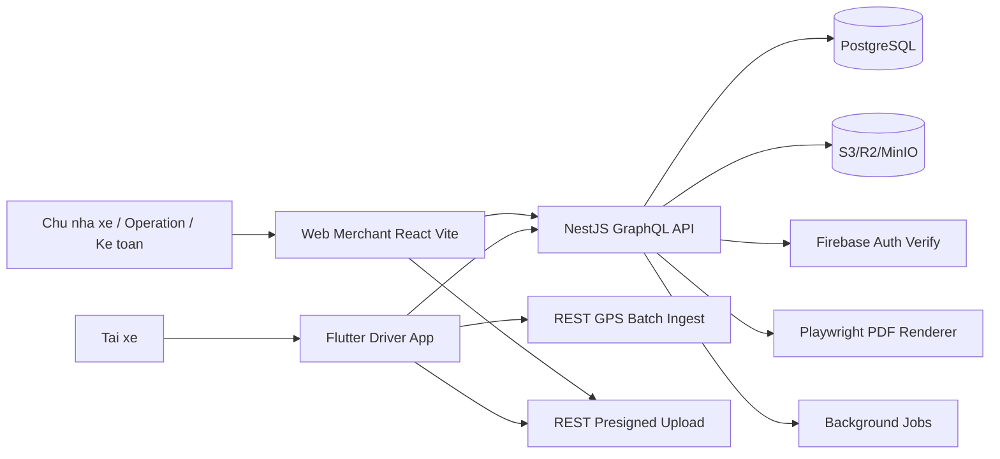

Ghi chú:

- Web dùng Firebase Auth để lấy ID token, gửi token lên API.
- App tài xế cần chốt cơ chế auth. Architecture dự phòng auth driver độc lập hoặc Firebase phone/email.
- API là nguồn sự thật duy nhất cho nghiệp vụ.
- Object storage chỉ lưu file; metadata, quyền truy cập và entity mapping nằm trong PostgreSQL.

---

## 5. Monorepo Layout

```text
code/
├── apps/
│   ├── api/
│   ├── web/
│   └── driver-app/
├── packages/
│   ├── db/
│   ├── shared/
│   ├── graphql/
│   ├── shadcn/
│   ├── ui/
│   ├── flutter-component/
│   ├── flutter-ui/
│   ├── i18n/
│   ├── routing/
│   └── config/
└── doc/
    ├── 1-BRD/
    ├── 2-PRD/
    ├── 3-TECHNICAL/
    └── 4-DESIGN/
```

### 5.1. Apps

| App | Stack | Trách nhiệm |
|---|---|---|
| `apps/api` | NestJS, GraphQL, Prisma | Business API, auth, tenant, audit, PDF, upload, GPS ingest |
| `apps/web` | React, Vite, Apollo, Tailwind/shadcn | Web Merchant |
| `apps/driver-app` | Flutter, Bloc đề xuất, GraphQL | App Tài xế |

### 5.2. Packages dùng chung

| Package | Trách nhiệm |
|---|---|
| `@bta/db` | Prisma schema, migration, seed, Prisma client wrapper |
| `@bta/shared` | Status constants, permission constants, zod schema, money/date helpers |
| `@bta/graphql` | Generated GraphQL types/hooks, shared operations |
| `@bta/shadcn` | UI chính cho web |
| `@bta/ui` | MUI wrapper khi cần component có sẵn |
| `@bta/flutter-ui` | Design tokens/component Flutter |
| `@bta/flutter-component` | Component nghiệp vụ Flutter |
| `@bta/i18n` | Text tiếng Việt trước, chuẩn bị tiếng Anh |
| `@bta/routing` | Route constants cho web |
| `@bta/config` | ESLint, Prettier, TypeScript config |

---

## 6. Backend Architecture

Backend phase 1 là modular monolith. Mỗi domain là một NestJS module có ranh giới rõ, nhưng cùng database để giữ transaction đơn giản cho nghiệp vụ tiền, audit và snapshot.

### 6.1. Module map

| Module | Trách nhiệm chính |
|---|---|
| `auth` | Verify Firebase ID token, driver auth, principal, session context |
| `merchants` | Tenant, settings, onboarding merchant, seed danh mục mặc định |
| `users` | Nhân viên merchant, role, permission |
| `customers` | Khách hàng, địa chỉ thường dùng, hạn mức nợ, số dư |
| `drivers` | Hồ sơ tài xế, tài khoản app, lương cố định, lịch sử lương |
| `vehicles` | Xe, lịch sử chạy suy từ trip, chi phí vật tư |
| `suppliers` | NCC vận tải/vật tư, công nợ phải trả |
| `catalogs` | Danh mục merchant tự định nghĩa |
| `orders` | Order, stop, cargo, addon, order status, order financial summary |
| `trips` | Trip, phân công stop, trạng thái trip/stop, GPS, điều phối |
| `finance` | Expense, payment, allocation, COD, customer credit, supplier debt |
| `payrolls` | Bảng lương, line/item, duyệt, snapshot kỳ |
| `reports` | Dashboard, báo cáo, export Excel/PDF |
| `attachments` | Metadata file, presigned URL, link entity |
| `notifications` | Notification nội bộ web/app |
| `audit` | Status history, activity log, reason policy |
| `imports` | Import Excel preview/validate/commit |

### 6.2. Layer trong module

```text
module/
├── domain/
│   ├── entities/
│   ├── value-objects/
│   ├── policies/
│   └── events/
├── application/
│   ├── use-cases/
│   ├── dto/
│   └── ports/
├── infrastructure/
│   ├── prisma/
│   ├── storage/
│   └── external/
└── presentation/
    ├── graphql/
    └── rest/
```

Quy tắc phụ thuộc:

- `domain` không phụ thuộc NestJS, Prisma, GraphQL.
- `application` điều phối use-case và phụ thuộc interface repository.
- `infrastructure` implement repository bằng Prisma/S3/Firebase.
- `presentation` map GraphQL/REST input-output sang use-case.

### 6.3. Cross-cutting services

| Service | Chức năng |
|---|---|
| `TenantContext` | Lấy `merchant_id`, `actor_id`, `actor_type`, role từ request |
| `PermissionService` | Kiểm tra quyền theo role và action |
| `ReasonPolicyService` | Xác định action nào bắt buộc nhập lý do |
| `AuditService` | Ghi activity/audit log trong cùng transaction |
| `StatusHistoryService` | Ghi thay đổi trạng thái theo entity |
| `NumberingService` | Sinh mã chứng từ theo merchant và loại |
| `NotificationService` | Tạo notification nội bộ |
| `AttachmentService` | Presign, xác nhận upload, gắn file vào entity |
| `MoneyService` | Cộng trừ tiền bằng integer, format VND |

---

## 7. Frontend Web Architecture

Web Merchant là một app host duy nhất trong phase 1, chia domain bằng lazy route và feature libs.

### 7.1. Route-level modules

| Route group | Domain |
|---|---|
| `/` | Dashboard |
| `/orders` | Đơn hàng, chi tiết order, stop, cargo, addon |
| `/dispatch` | Điều phối trip, lịch xe/tài xế, warning |
| `/finance` | Thu chi, công nợ khách/NCC/tài xế, COD |
| `/payroll` | Bảng lương, duyệt, chi trả |
| `/customers` | Khách hàng, địa chỉ, hạn mức, lịch sử |
| `/drivers` | Tài xế, lương cố định, sổ đối chiếu |
| `/vehicles` | Xe, lịch sử chạy, chi phí vật tư |
| `/suppliers` | NCC, khoản chi, công nợ |
| `/reports` | Báo cáo, export |
| `/settings` | Merchant settings, role, catalog, numbering |

### 7.2. State và data fetching

- Apollo Client là nguồn data server.
- Local UI state dùng React state hoặc Zustand nhẹ nếu cần chia sẻ trong một feature.
- Form dùng `react-hook-form` + zod schema từ `@bta/shared`.
- Route loaders chỉ dùng cho dữ liệu shell/auth; domain page tự fetch bằng GraphQL query.
- Mutation quan trọng phải trả về entity mới nhất và event/audit summary để UI cập nhật timeline.

### 7.3. Component strategy

- Layout, form, table, tabs, dialog dùng `@bta/shadcn`.
- `@bta/ui` chỉ dùng khi cần component MUI đã có sẵn và không làm lệch visual system.
- Feature component không gọi trực tiếp API ngoài GraphQL hooks.
- Permission gate đặt ở UI để ẩn/disable action, nhưng backend vẫn là nơi enforce thật.

---

## 8. Driver App Architecture

App tài xế dùng Flutter clean architecture.

```text
lib/
├── core/
│   ├── auth/
│   ├── network/
│   ├── offline/
│   ├── location/
│   └── upload/
├── features/
│   ├── auth/
│   ├── jobs/
│   ├── trip_detail/
│   ├── pod/
│   ├── cod/
│   ├── notifications/
│   └── profile/
└── shared/
```

### 8.1. Layer

| Layer | Nội dung |
|---|---|
| `data` | GraphQL datasource, REST GPS/upload datasource, local queue |
| `domain` | Entity, repository interface, use-case |
| `presentation` | Bloc/Cubit, screen, widget |

### 8.2. Offline behavior

App cần có local queue cho các hành động:

- Cập nhật trạng thái trip.
- Cập nhật trạng thái stop.
- Nhập COD thực thu.
- Upload POD/chứng từ.
- Gửi GPS batch.

Mỗi queued item cần:

- `client_request_id` để idempotency.
- Payload.
- Thời điểm tạo trên thiết bị.
- Số lần retry.
- Trạng thái sync.

Backend phải xử lý idempotency để tránh duplicate khi app gửi lại.

---

## 9. Multi-tenant Architecture

### 9.1. Tenant model

- `merchant` là tenant gốc.
- Mọi bảng nghiệp vụ phải có `merchant_id`.
- Bảng liên quan trực tiếp tới auth global có thể không có `merchant_id`, nhưng bảng mapping sang merchant bắt buộc có.

Ví dụ:

| Bảng | Có `merchant_id` | Ghi chú |
|---|---:|---|
| `merchant` | Không | Tenant root |
| `user` | Có | Nhân viên thuộc merchant |
| `driver` | Có | Tài xế thuộc merchant |
| `order` | Có | Bắt buộc |
| `trip` | Có | Bắt buộc dù suy ra từ order |
| `payment_in` | Có | Bắt buộc |
| `attachment` | Có | Bắt buộc để kiểm tra quyền file |
| `audit_log` | Có | Bắt buộc |

### 9.2. Enforcement

API không tin `merchant_id` từ client.

Luồng request:

1. Guard verify token.
2. Resolve principal thành `merchant_id`, role, actor type.
3. Inject `TenantContext`.
4. Repository/Prisma extension tự thêm filter `merchant_id`.
5. Mutation tạo mới tự set `merchant_id` từ context.
6. Audit log ghi cùng `merchant_id`.

### 9.3. Database safety

- Index composite theo `merchant_id` + cột hay query.
- Unique constraint phải scope theo `merchant_id`, ví dụ `(merchant_id, order_code)`.
- Không expose ID tuần tự đoán được ra public link nếu có rủi ro; dùng UUID/CUID cho primary key.
- Tất cả báo cáo/export phải lọc tenant từ context.

---

## 10. Auth, RBAC và Sensitive Actions

### 10.1. Principal types

| Principal | Phase | Cách xác thực |
|---|---|---|
| Merchant user | Phase 1 | Firebase Auth Google login |
| Driver | Phase 1 | Chưa chốt; dự phòng driver credential hoặc Firebase |
| Customer | Phase 3 | Chưa triển khai |

### 10.2. Role mặc định

| Role | Quyền chính |
|---|---|
| `admin` / giám đốc | Toàn quyền, duyệt/hủy duyệt bảng lương, quản lý settings |
| `operation` | Tạo/sửa order, điều phối, cập nhật trạng thái, chi phí vận hành |
| `accountant` / kế toán | Thu chi, phân bổ tiền, công nợ, bảng lương, báo cáo |
| `driver` | Xem trip được giao, cập nhật trip/stop, POD, COD, GPS của mình |

### 10.3. Permission actions

Các action nhạy cảm phải có permission riêng và audit:

- Sửa giá cước sau khi order đã xác nhận.
- Sửa/xóa chi phí.
- Sửa/xóa phiếu thu, phiếu chi.
- Sửa order đã hoàn thành.
- Đổi trạng thái ngược.
- Hủy order/trip.
- Sửa COD thực thu.
- Sửa bảng lương sau khi tạo.
- Duyệt/hủy duyệt bảng lương.

### 10.4. Reason policy

Các action nhạy cảm nên bắt buộc `reason`.

```text
mutation input:
  entityId
  patch
  reason
  clientRequestId
```

Backend kiểm tra:

- Actor có quyền không.
- Action có bắt buộc lý do không.
- Entity có thuộc tenant không.
- Entity có đang ở trạng thái cho phép sửa mềm không.
- Ghi audit trước/sau trong cùng transaction.

---

## 11. Domain Boundaries

### 11.1. Order domain

Order là hợp đồng nghiệp vụ với khách hàng:

- Khách hàng.
- Giá cước nhập tay cho cả đơn.
- Hạn thanh toán nhập tay.
- Điểm lấy/trả.
- Hàng hóa ghi chú.
- Add-on service thu thêm.
- Trạng thái order.
- Tổng phải thu khách.

Order không chứa chi tiết xe/tài xế trực tiếp; phần đó thuộc Trip.

### 11.2. Trip/Dispatch domain

Trip là lần chạy xe:

- Thuộc một order.
- Có xe + tài xế hoặc thông tin thuê ngoài.
- Có thời gian dự kiến.
- Có trạng thái vận hành.
- Có stop assignment.
- Có GPS log.
- Có chi phí chuyến.
- Có thưởng tài xế nhập tay.

Một order có 1..n trip.

### 11.3. Finance domain

Finance quản lý dòng tiền:

- `payment_in`: tiền vào.
- `expense`: tiền ra.
- `payment_allocation`: phân bổ tiền khách vào order.
- Customer credit: tiền khách trả dư/chưa phân bổ.
- Supplier debt: expense chưa trả gắn NCC.
- Driver ledger: COD tài xế giữ, chi phí tài xế ứng, ứng lương.

Doanh thu không lấy từ phiếu thu. Doanh thu lấy từ order: giá cước + add-on.

### 11.4. Payroll domain

Payroll quản lý lương theo kỳ:

- Lương cố định snapshot từ lịch sử lương tài xế.
- Thưởng theo order/trip do operation nhập tay.
- Ứng lương lấy từ expense loại ứng lương hoặc payroll item.
- Giảm trừ nhập tay kèm lý do.
- Luồng duyệt bởi admin/giám đốc.

Payroll không tự tính theo công thức phần trăm.

### 11.5. Audit/Timeline domain

Audit là domain nền:

- `status_history` ghi thay đổi trạng thái.
- `activity_log` ghi nghiệp vụ quan trọng.
- `audit_log` ghi trước/sau cho dữ liệu nhạy cảm.
- Timeline entity tổng hợp từ các log này.

---

## 12. Data Architecture

### 12.1. Nhóm bảng chính

| Nhóm | Bảng |
|---|---|
| Tenant/Auth | `merchants`, `users`, `roles`, `permissions`, `user_roles`, `driver_accounts` |
| Catalog | `catalogs`, `catalog_items` |
| Master data | `customers`, `customer_locations`, `drivers`, `driver_salary_history`, `vehicles`, `suppliers` |
| Order | `orders`, `order_stops`, `cargo_lines`, `order_addons`, `external_transport_infos` |
| Dispatch | `trips`, `trip_stop_assignments`, `trip_locations`, `incidents` |
| Finance | `payment_ins`, `payment_allocations`, `expenses`, `driver_ledger_entries` |
| Debt statement | `debt_statements`, `debt_statement_lines` |
| Payroll | `payrolls`, `payroll_lines`, `payroll_line_items` |
| File/Log | `attachments`, `status_histories`, `activity_logs`, `audit_logs`, `notifications` |
| System | `number_sequences`, `import_jobs`, `export_jobs` |

### 12.2. ERD khái niệm

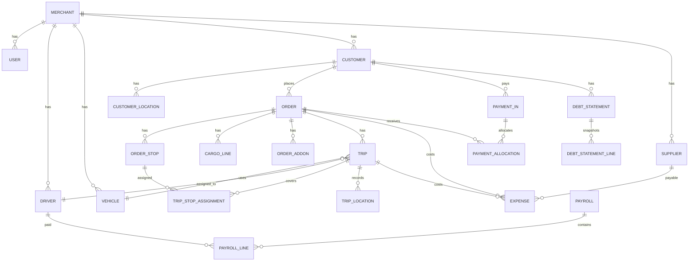

### 12.3. Money rules

- Tất cả số tiền lưu `BigInt` hoặc integer an toàn cho VND.
- Không dùng số âm trừ khi bảng là ledger có quy ước debit/credit rõ.
- Mọi phép tính lãi/lỗ, còn nợ, số dư phải có service/helper dùng chung.
- Các báo cáo tài chính dùng cùng công thức với màn hình chi tiết để tránh lệch số.

### 12.4. Derived values

Không cần lưu bảng riêng cho các số có thể tính:

| Chỉ số | Công thức |
|---|---|
| Tổng thu order | `freight_amount + sum(order_addons.amount)` |
| Đã thu order | `sum(payment_allocations.amount)` |
| Còn nợ order | `total_order_receivable - paid_amount` |
| Số dư khách | `sum(payment_in.amount) - sum(payment_allocations.amount)` |
| Công nợ NCC | `sum(expense.amount where supplier_id and unpaid)` |
| Lãi/lỗ order | `freight + addons - expenses(order + trips)` |
| COD tài xế giữ | `sum(COD actual collected) - sum(driver COD remittance)` |

Các snapshot ngoại lệ:

- `debt_statement_lines` lưu số tại thời điểm chốt bảng kê.
- `payroll_lines` lưu snapshot lương cố định, thưởng, ứng, giảm trừ tại thời điểm tạo/duyệt.

---

## 13. Status Architecture

### 13.1. Order statuses

| Status | Ý nghĩa |
|---|---|
| `DRAFT` | Nháp |
| `PENDING_CONFIRMATION` | Chờ xác nhận |
| `CONFIRMED` | Đã xác nhận |
| `DISPATCHED` | Đã xếp xe |
| `IN_PROGRESS` | Đang thực hiện |
| `COMPLETED` | Hoàn thành |
| `CANCELLED` | Đã hủy |

### 13.2. Trip statuses

| Status | Ý nghĩa |
|---|---|
| `SCHEDULED` | Đã lên lịch |
| `TO_PICKUP` | Đang đến điểm lấy |
| `PICKING_UP` | Đang lấy hàng |
| `IN_TRANSIT` | Đang vận chuyển |
| `PAUSED` | Tạm dừng, kèm lý do |
| `DELIVERING` | Đang trả hàng |
| `COMPLETED` | Hoàn thành |
| `CANCELLED` | Đã hủy |

Trip cần lưu thêm:

- `paused_reason_id`
- `previous_status_before_pause`
- `paused_at`
- `resumed_at`

### 13.3. Stop statuses

| Status | Ý nghĩa |
|---|---|
| `NOT_ARRIVED` | Chưa đến |
| `ARRIVED` | Đã đến |
| `COMPLETED` | Hoàn thành |
| `SKIPPED` | Bỏ qua, kèm lý do |

### 13.4. Status history

Mọi đổi trạng thái ghi:

- `entity_type`
- `entity_id`
- `from_status`
- `to_status`
- `reason`
- `actor_type`
- `actor_id`
- `merchant_id`
- `changed_at`
- `metadata`

Status không khóa cứng toàn bộ luồng, nhưng backend có thể warning hoặc yêu cầu permission khi đổi ngược/hủy/sửa hoàn thành.

---

## 14. Key Business Flows

### 14.1. Tạo order một xe

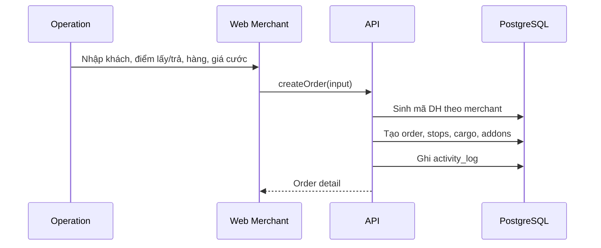

Thiết kế UI cần tối ưu case phổ biến:

- Form tạo order cho phép tạo nhanh 1 trip mặc định sau khi có order.
- Nếu chỉ 1 xe, hệ thống tự gán tất cả stops cho trip.
- Không bắt operation đi qua nhiều bước kỹ thuật.

### 14.2. Điều phối trip

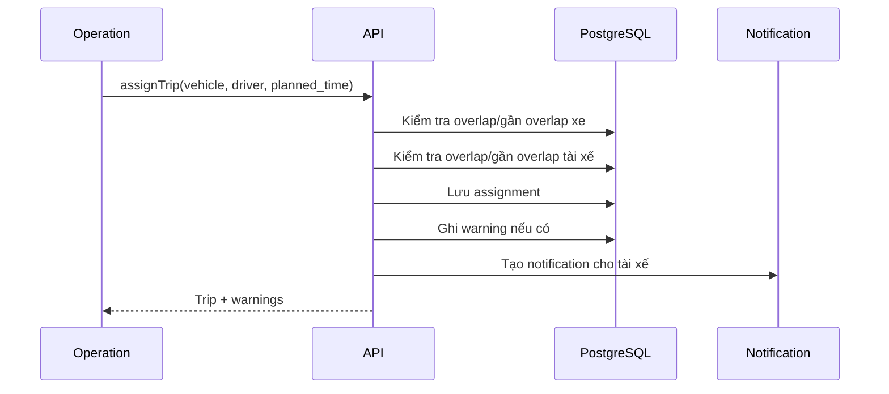

Warning mềm:

- Không chặn lưu.
- Trả về danh sách warning để UI hiển thị.
- Lưu audit nếu operation vẫn tiếp tục khi có warning lớn.

### 14.3. Tài xế cập nhật trạng thái và POD

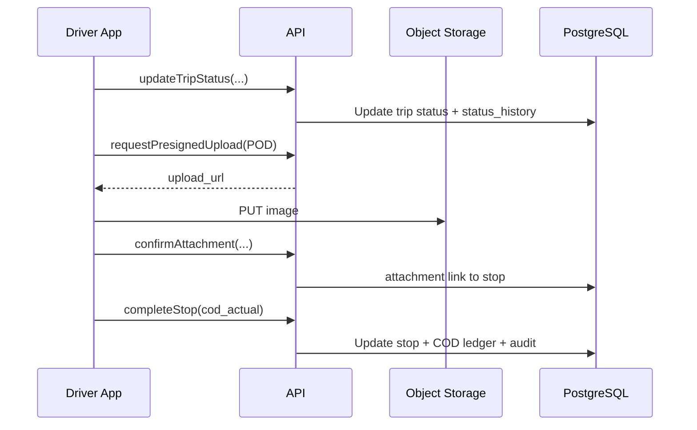

### 14.4. Khách thanh toán và phân bổ công nợ

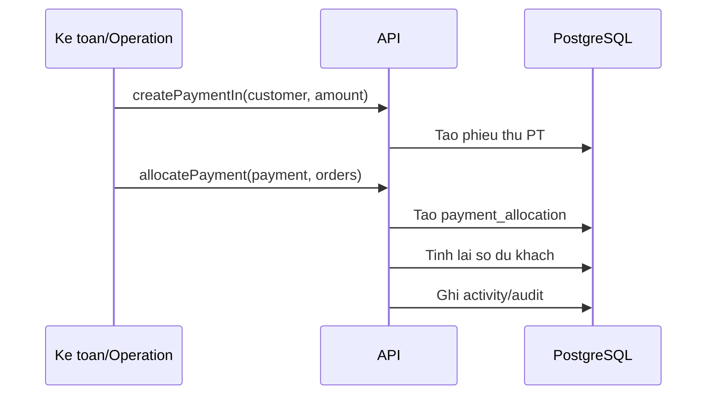

Quy tắc:

- Một payment có thể phân bổ nhiều order.
- Payment chưa phân bổ hết tạo số dư khách.
- Hạn thanh toán nhập theo từng order, không tự tính mặc định nếu user override.
- Warning quá hạn chỉ là cảnh báo trong app.

### 14.5. COD tài xế

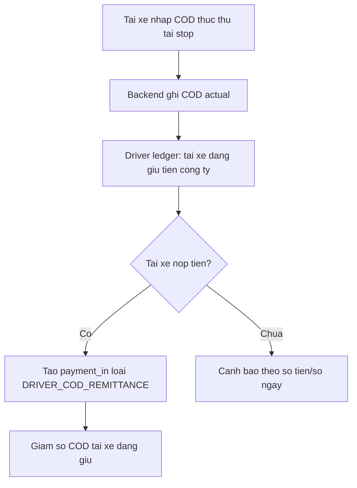

Lưu ý kế toán:

- Tiền tài xế nộp COD là thu hồi khoản phải thu từ tài xế.
- Không tính khoản này là doanh thu.
- Doanh thu đã nằm ở order.

### 14.6. Chi phí và công nợ nhà cung cấp

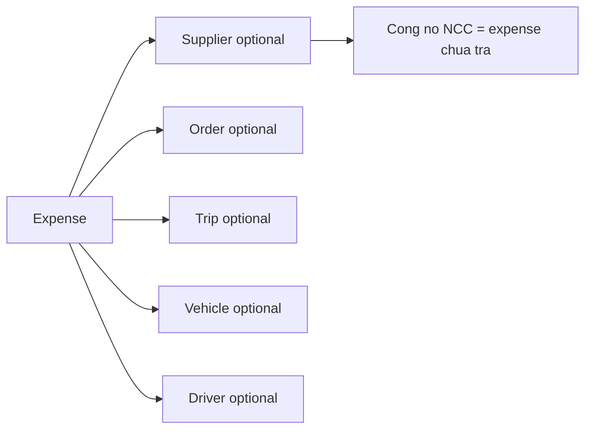

Các loại expense:

- Chi phí chuyến: cầu đường, bốc xếp, bồi dưỡng.
- Thuê xe ngoài: luôn gắn order.
- Vật tư xe: xăng dầu, lốp, sửa chữa, ắc quy.
- Hoàn ứng tài xế.
- Ứng lương tài xế.
- Tạm ứng chuyến.

### 14.7. Tạm ứng chuyến

```text
Trước chuyến:
  Công ty đưa tài xế tiền đi đường -> expense/payment out loại TRIP_ADVANCE

Sau chuyến:
  Tài xế khai chi phí thực tế -> trip expenses
  Đối soát:
    nếu chi phí thực tế > tạm ứng: công ty hoàn thêm
    nếu chi phí thực tế < tạm ứng: tài xế nộp lại
```

Tạm ứng chuyến khác ứng lương:

- Tạm ứng chuyến phục vụ trip/order, đối soát theo chi phí.
- Ứng lương trừ vào bảng lương.

### 14.8. Bảng kê công nợ PDF

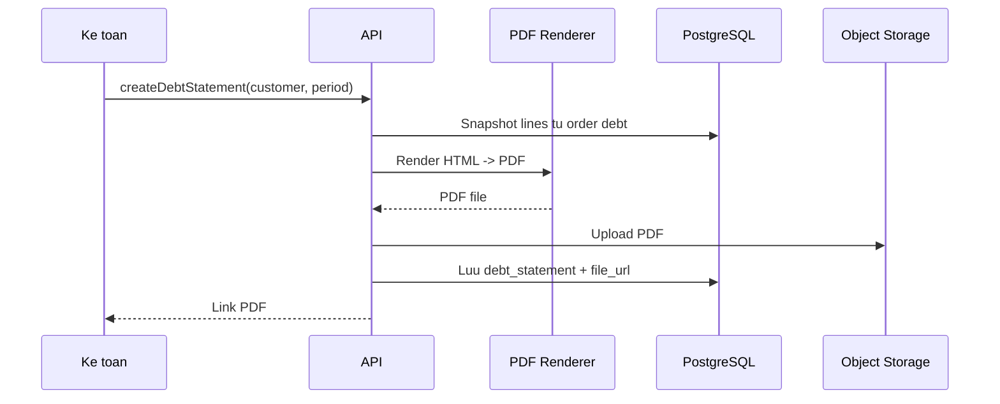

Quy tắc:

- Snapshot không đổi khi order/payment thay đổi sau đó.
- Có trạng thái: `DRAFT`, `FINALIZED`, `SENT`, `CANCELLED`.
- Operation tự gửi file qua kênh ngoài hệ thống.

### 14.9. Bảng lương

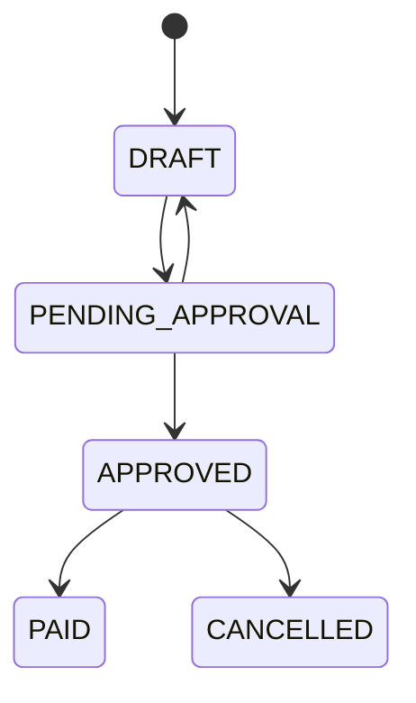

Payroll line:

- Lương cố định snapshot.
- Thưởng từng trip/order.
- Ứng lương.
- Giảm trừ/phạt có lý do.
- Thực lãnh.

Chỉ admin/giám đốc được duyệt/hủy duyệt.

---

## 15. GraphQL API Design

### 15.1. Schema organization

GraphQL code-first theo NestJS:

- `*.object.ts`: object type.
- `*.input.ts`: input type.
- `*.resolver.ts`: query/mutation.
- `*.connection.ts`: pagination type.

Tên API nên theo domain:

```graphql
type Query {
  orders(filter: OrderFilterInput, paging: PagingInput): OrderConnection!
  order(id: ID!): Order
  trips(filter: TripFilterInput, paging: PagingInput): TripConnection!
  customerDebt(customerId: ID!): CustomerDebtSummary!
}

type Mutation {
  createOrder(input: CreateOrderInput!): Order!
  updateOrder(input: UpdateOrderInput!): Order!
  changeOrderStatus(input: ChangeStatusInput!): Order!
  assignTrip(input: AssignTripInput!): AssignTripPayload!
  createPaymentIn(input: CreatePaymentInInput!): PaymentIn!
  allocatePayment(input: AllocatePaymentInput!): PaymentAllocationPayload!
}
```

### 15.2. Pagination/filter

- Cursor pagination cho list lớn.
- Filter theo status, date range, customer, driver, vehicle, debt state.
- Sort whitelist; không cho sort arbitrary field trực tiếp.

### 15.3. Mutation result pattern

Mutation có warning nên trả payload:

```graphql
type AssignTripPayload {
  trip: Trip!
  warnings: [BusinessWarning!]!
}
```

Mutation bình thường có thể trả entity.

### 15.4. Idempotency

Các mutation từ mobile/offline hoặc payment nên có `clientRequestId`.

- Backend lưu `idempotency_key` theo merchant + actor + action.
- Nếu nhận lại cùng key, trả kết quả cũ hoặc bỏ qua duplicate.
- Dùng cho update status, POD confirm, COD, GPS batch, payment creation.

---

## 16. REST Endpoints Đặc Thù

GraphQL là chính, REST chỉ dùng nơi phù hợp hơn.

### 16.1. Upload presigned URL

```http
POST /uploads/presign
POST /uploads/confirm
GET  /uploads/:id/download-url
```

Presign input:

- `entityType`
- `entityId`
- `documentType`
- `fileName`
- `contentType`
- `fileSize`

Confirm input:

- `uploadId`
- `storageKey`
- `checksum`

### 16.2. GPS batch ingest

```http
POST /driver/trips/:tripId/locations/batch
```

Payload:

```json
{
  "clientRequestId": "uuid",
  "points": [
    {
      "lat": 10.762622,
      "lng": 106.660172,
      "accuracyMeters": 25,
      "recordedAt": "2026-09-23T02:30:00Z",
      "batteryLevel": 0.72
    }
  ]
}
```

Backend:

- Chỉ nhận nếu driver được gán trip.
- Chỉ ghi khi trip đang ở trạng thái đang chạy/liên quan.
- Deduplicate theo `clientRequestId` hoặc hash point.
- Có thể batch insert.

---

## 17. Attachment Architecture

### 17.1. Attachment targets

Attachment có thể gắn vào:

- Order.
- Trip.
- Stop.
- Expense.
- Payment.
- Customer.
- Driver.
- Vehicle.
- Supplier.
- Incident.
- Debt statement.
- Payroll.

### 17.2. Document types

- POD.
- Phiếu xuất kho.
- Hóa đơn.
- Biên nhận bốc xếp.
- Chứng từ chi phí.
- Ảnh sự cố.
- Hợp đồng/thỏa thuận.
- Chứng từ thanh toán.
- PDF bảng kê công nợ.
- Mẫu in/chia sẻ nhanh.

### 17.3. Storage key convention

```text
merchant/{merchantId}/{entityType}/{entityId}/{yyyy}/{mm}/{attachmentId}-{safeFileName}
```

Không dùng tên file người dùng làm key trực tiếp. Metadata lưu trong DB.

---

## 18. Audit và Timeline

### 18.1. Activity log

Dùng để hiển thị timeline thân thiện:

- Ai tạo order.
- Ai sửa giá.
- Ai thêm chi phí.
- Ai phân bổ tiền.
- Ai đổi trạng thái.
- Ai upload POD.
- Ai duyệt bảng lương.

### 18.2. Audit log

Dùng cho kiểm tra dữ liệu nhạy cảm:

- Entity trước/sau.
- Patch chi tiết.
- Actor.
- Reason.
- IP/user agent nếu có.
- `client_request_id`.

### 18.3. Actions bắt buộc audit

- Tất cả thao tác tiền.
- Tất cả đổi trạng thái.
- Tất cả upload/delete attachment.
- Tất cả sửa/xóa dữ liệu nhạy cảm.
- Tất cả override warning quan trọng.

---

## 19. Numbering Architecture

Mã tự động theo merchant và loại chứng từ.

| Loại | Format mặc định |
|---|---|
| Order | `DH-YYYYMM-0001` |
| Trip | `CX-YYYYMM-0001` |
| Phiếu thu | `PT-YYYYMM-0001` |
| Phiếu chi | `PC-YYYYMM-0001` |
| Bảng lương | `BL-YYYYMM-0001` |
| Bảng kê công nợ | `CN-YYYYMM-0001` |

`number_sequences`:

- `merchant_id`
- `document_type`
- `period`
- `prefix`
- `current_value`
- `padding`

Sinh mã phải chạy trong transaction hoặc dùng row lock để tránh trùng khi nhiều người tạo cùng lúc.

---

## 20. Notifications

### 20.1. Notification types

- Tài xế có chuyến mới.
- Order quá hạn thanh toán.
- COD tài xế chưa nộp.
- Bảng lương chờ duyệt.
- Chuyến bị trùng/gần trùng lịch xe/tài xế.
- Có sự cố mới cần xử lý.
- GPS/dashboard phát hiện bất thường trong phase sau.

### 20.2. Delivery

Phase 1:

- Lưu notification trong DB.
- Web/app polling notification.
- Chưa cần push/email cho khách.

Sau này:

- Push notification cho app tài xế.
- Email/Zalo integration nếu chủ dự án yêu cầu.

---

## 21. Reports, Export và PDF

### 21.1. Dashboard

Dashboard phase 1 dùng polling:

- Chuyến đang chạy.
- Trạng thái xe/tài xế.
- Công nợ quá hạn.
- COD tài xế đang giữ.
- Bảng lương chờ duyệt.
- Incident đang mở.

### 21.2. Báo cáo

Theo khoảng thời gian:

- Doanh thu.
- Chi phí.
- Lãi/lỗ theo order.
- Lãi/lỗ theo khách.
- Chi phí/lịch sử theo xe.
- Thưởng/lịch sử theo tài xế.
- Công nợ khách.
- Công nợ NCC.
- Công nợ tài xế.

### 21.3. Export Excel

Export:

- Danh sách order.
- Công nợ.
- Bảng lương.
- COD tài xế đang giữ.

Import:

- Khách hàng.
- Xe.
- Tài xế.

Import flow:

1. Upload file.
2. Parse.
3. Validate.
4. Preview lỗi/cảnh báo.
5. User confirm.
6. Commit data.
7. Ghi import job + audit.

### 21.4. PDF templates

PDF phase 1:

- Bảng kê công nợ.
- Phiếu giao hàng.
- Phiếu điều xe.
- Bảng chi phí chuyến.
- Bảng đối soát tài xế.
- Bảng lương tài xế.

Render bằng HTML template để dễ style, sau đó Playwright xuất PDF.

---

## 22. GPS Architecture

### 22.1. Client behavior

App tài xế:

- Chỉ bật tracking khi có trip đang chạy.
- Gửi batch mỗi 15-30 giây hoặc khi gom đủ điểm.
- Buffer offline khi mất mạng.
- Tắt tracking khi trip completed/cancelled.

### 22.2. Backend behavior

- Validate driver được gán trip.
- Validate trip thuộc merchant.
- Batch insert `trip_locations`.
- Lưu `recorded_at` từ thiết bị và `received_at` từ server.
- Có index `(merchant_id, trip_id, recorded_at)`.

### 22.3. Retention

GPS có volume lớn, cần policy:

- Giữ raw GPS 3-6 tháng theo cấu hình.
- Sau đó có thể downsample hoặc archive.
- Phase 1 có thể chưa cần job dọn, nhưng schema nên sẵn sàng.

---

## 23. External Transport

Thuê xe ngoài trong BRD được xem là một khoản chi gắn order, nhưng vẫn cần thông tin vận hành tối thiểu.

### 23.1. Model đề xuất

- `external_transport_info`
  - `order_id`
  - `trip_id` optional
  - `supplier_id`
  - `external_vehicle_plate`
  - `external_driver_name`
  - `external_driver_phone`
  - `agreed_amount`
  - `note`

Khoản tiền thuê thực tế vẫn là `expense` gắn `order_id` và `supplier_id`.

### 23.2. Reporting

Lãi/lỗ order phải tính:

- Chi phí thuê ngoài gắn order.
- Chi phí phát sinh các trip.
- Add-on thu khách.

---

## 24. Incident Architecture

Incident tách khỏi trạng thái `PAUSED`.

| Field | Ý nghĩa |
|---|---|
| `type` | Hư xe, trễ giờ, hàng hư/thiếu, khách đổi điểm, không giao được, sai COD, chi phí bất thường |
| `severity` | Low/Medium/High/Critical |
| `status` | Open/In progress/Resolved/Cancelled |
| `order_id` | Optional |
| `trip_id` | Optional |
| `assigned_user_id` | Người xử lý |
| `description` | Mô tả |
| `resolved_note` | Ghi chú xử lý |

Incident có attachment riêng cho ảnh/chứng từ.

---

## 25. Security

### 25.1. Application security

- Verify Firebase ID token ở backend, không tin client.
- Enforce tenant trên mọi repository.
- Enforce RBAC backend cho mọi mutation.
- Bắt lý do với sensitive actions.
- Audit mọi thao tác tiền/trạng thái/file.
- Presigned URL có TTL ngắn.
- Download file cũng qua quyền backend hoặc signed URL ngắn hạn.

### 25.2. Data security

- Không log token, password, presigned URL dài hạn.
- Không lưu secret trong repo.
- `.env.example` chỉ chứa key public hoặc placeholder.
- Backup PostgreSQL định kỳ.
- Object storage bật versioning nếu dùng S3/R2 và chi phí cho phép.

### 25.3. Financial safety

- Không xóa cứng payment/expense/payroll sau khi phát hành; dùng cancel/reversal.
- Mutation tài chính chạy transaction.
- Snapshot khi chốt debt statement/payroll.
- Số tiền dùng integer.
- Permission riêng cho sửa dữ liệu tài chính.

---

## 26. Performance và Scalability

### 26.1. Expected bottlenecks

- List order/trip lớn theo merchant.
- Báo cáo tài chính theo khoảng thời gian.
- GPS location volume.
- Export PDF/Excel.
- Attachment upload/download.

### 26.2. Index đề xuất

- `orders(merchant_id, status, created_at)`
- `orders(merchant_id, customer_id, created_at)`
- `trips(merchant_id, driver_id, planned_start_at, planned_end_at)`
- `trips(merchant_id, vehicle_id, planned_start_at, planned_end_at)`
- `order_stops(merchant_id, order_id, sequence)`
- `payment_allocations(merchant_id, order_id)`
- `expenses(merchant_id, supplier_id, paid_status)`
- `trip_locations(merchant_id, trip_id, recorded_at)`
- `notifications(merchant_id, recipient_id, read_at, created_at)`

### 26.3. Background jobs

Nên có job queue cho:

- Render PDF.
- Export Excel.
- Import Excel commit.
- Notification generation định kỳ.
- Debt overdue recalculation nếu cần cache.
- GPS cleanup/downsample sau này.

Phase đầu có thể dùng BullMQ + Redis nếu cần job thực sự. Nếu muốn đơn giản MVP, job ngắn có thể chạy inline nhưng API phải sẵn abstraction để tách ra.

---

## 27. Deployment Architecture

### 27.1. Dev

```text
Docker Compose:
  postgres
  minio
  api
  web
```

Port dev theo BRD:

- API: `2001`
- Web: `2002`

### 27.2. Production sơ bộ

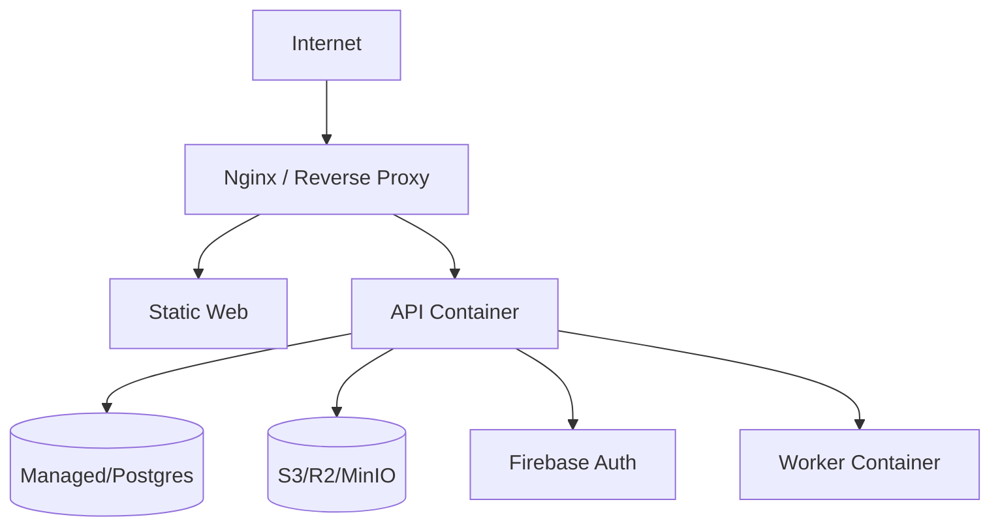

Phương án ban đầu:

- 1 VPS + Docker Compose nếu quy mô nhỏ.
- Tách Postgres managed khi dữ liệu quan trọng tăng.
- Object storage dùng S3/R2 production, MinIO dev.
- CI build/test bằng GitHub Actions + `nx affected`.

---

## 28. Testing Strategy

### 28.1. Backend

- Unit test domain policies:
  - Tính công nợ order.
  - Customer credit.
  - COD driver ledger.
  - Lãi/lỗ order.
  - Payroll calculation.
  - Schedule overlap warning.
- Integration test GraphQL use-case:
  - Create order nhiều stop.
  - Assign trip.
  - Driver complete stop + COD.
  - Payment allocation.
  - Debt statement snapshot.
  - Payroll approval.
- Repository test cho tenant filter.

### 28.2. Web

- Component test form quan trọng.
- E2E Playwright:
  - Login mock.
  - Tạo order 1 xe.
  - Điều phối trip.
  - Ghi payment + phân bổ.
  - Xuất bảng kê.
  - Tạo bảng lương và duyệt.

### 28.3. Driver app

- Unit test use-case offline queue.
- Widget test màn danh sách việc và chi tiết trip.
- Integration test:
  - Update status offline rồi sync.
  - Upload POD.
  - Nhập COD.
  - GPS batch retry.

### 28.4. Data quality tests

- Không có nghiệp vụ row thiếu `merchant_id`.
- Không có payment allocation vượt số payment.
- Không có order debt âm trừ khi có credit handling rõ.
- Không có payroll approved nhưng line thiếu snapshot.

---

## 29. Observability và vận hành

### 29.1. Logging

Log backend nên có:

- `request_id`
- `merchant_id`
- `actor_id`
- `actor_type`
- `operation_name`
- duration
- error code

Không log:

- Token.
- Presigned URL đầy đủ.
- Payload ảnh/file.

### 29.2. Metrics

- API latency theo operation.
- GraphQL error rate.
- PDF/export job duration.
- Upload confirm failure rate.
- GPS batch points/minute.
- DB query slow log.

### 29.3. Alerts

Phase đầu có thể alert thủ công/log-based:

- API down.
- DB connection fail.
- PDF worker fail nhiều.
- Object storage upload lỗi.
- Queue backlog cao nếu dùng worker.

---

## 30. Implementation Roadmap

### 30.1. Foundation

1. Nx workspace + shared config.
2. `@bta/db` Prisma schema base.
3. Auth + tenant context.
4. RBAC + permission constants.
5. Numbering service.
6. Audit/status history nền.
7. Catalog defaults.

### 30.2. Core master data

1. Merchant settings.
2. Users/roles.
3. Customers + locations.
4. Drivers + salary history.
5. Vehicles.
6. Suppliers.

### 30.3. Order and dispatch

1. Order CRUD.
2. Stops, cargo, addons.
3. Trip CRUD.
4. Assign vehicle/driver + overlap warning.
5. Status updates + history.
6. Driver app job list/detail.
7. POD/COD.
8. GPS ingest.

### 30.4. Finance

1. Expenses.
2. Payment in.
3. Payment allocation.
4. Customer debt/credit.
5. Supplier debt.
6. Driver ledger.
7. COD warning.
8. Trip advance reconciliation.

### 30.5. Payroll and reports

1. Payroll period settings.
2. Payroll draft generation.
3. Approval flow.
4. PDF/Excel exports.
5. Debt statement snapshot/PDF.
6. Dashboard.

### 30.6. Hardening

1. Import preview/validate.
2. Notification refinements.
3. Incident dashboard.
4. Performance indexes.
5. Backup/restore checklist.
6. E2E regression suite.

---

## 31. Open Decisions

| Mã | Nội dung | Ảnh hưởng |
|---|---|---|
| O-001 | Auth app tài xế dùng Firebase hay credential riêng? | Driver login, reset password, account lifecycle |
| O-002 | Có dùng BullMQ/Redis ngay phase 1 hay để job inline trước? | PDF/export/import reliability |
| O-003 | Hosting production cụ thể: VPS Docker Compose hay managed services? | Backup, monitoring, deploy pipeline |
| O-004 | GPS retention bao lâu? | Dung lượng database, archive policy |
| O-005 | Bảng lương sau duyệt có cho sửa bằng adjustment không? | Audit và kế toán |
| O-006 | Module customer booking phase 3 cần giữ trước bao nhiêu trong schema? | Booking/order boundary |

---

## 32. Traceability từ BRD

| BRD | Nội dung được phản ánh |
|---|---|
| `00-brd.md` | Scope sản phẩm, web merchant, app tài xế, khách hàng, công nợ, lương |
| `01-decisions.md` | SaaS multi-tenant, stack, Nx, Firebase Google login |
| `02-nghiep-vu-don-hang.md` | Order/trip/stop, trạng thái, hàng hóa, addon, chi phí, POD |
| `03-nghiep-vu-cong-no.md` | Payment, allocation, customer credit, debt PDF, supplier debt |
| `04-nghiep-vu-luong-tai-xe.md` | Payroll, lương cố định, thưởng tay, ứng, giảm trừ, duyệt |
| `05-nghiep-vu-dieu-phoi.md` | Gán xe/tài xế, warning overlap, app tài xế, GPS |
| `06-scope-phase-1.md` | Phạm vi phase 1, bổ sung vận hành, nền kỹ thuật |
| `07-data-model.md` | ERD, bảng chính, derived values |
| `08-kien-truc.md` | Stack và cấu trúc monorepo đã chốt |
| `09-bo-sung-chuc-nang.md` | Mã tự động, audit, attachment, COD warning, snapshot, import/export |

