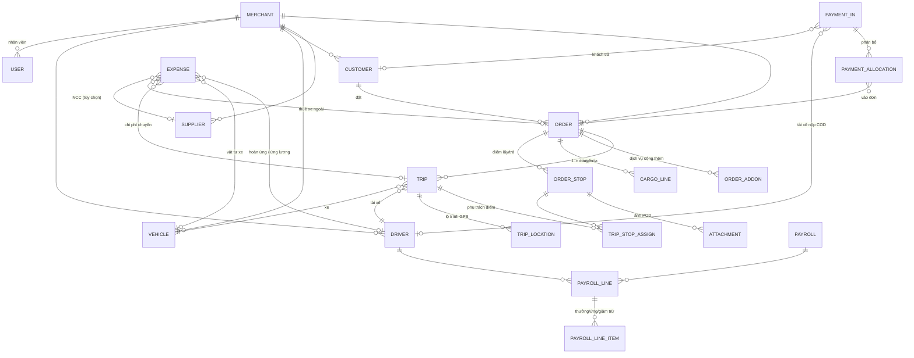

# Data Model (ERD) — Bản nháp phase 1

> Suy ra từ 4 tài liệu nghiệp vụ (02→05). Ngày lập: 2026-08-21
> Trạng thái: Chờ duyệt. Đây là mức khái niệm — tên bảng/cột chính xác sẽ chốt khi viết schema (Prisma/TypeORM).

## Nguyên tắc chung

- **Multi-tenant:** mọi bảng nghiệp vụ đều có `merchant_id`. Mọi query bắt buộc lọc theo tenant.
- **Tiền tệ:** VND, lưu số nguyên (không thập phân).
- **Không xóa cứng** dữ liệu nghiệp vụ — dùng soft delete / trạng thái.
- **Status history dùng chung:** một bảng `status_history` ghi mọi thay đổi trạng thái (entity, từ → sang, ai, lúc nào, lý do) — đáp ứng yêu cầu "operation sửa tự do nhưng lưu history".
- **Danh mục merchant tự định nghĩa** (loại chi phí, add-on, lý do tạm dừng, lý do giảm trừ, loại hàng): chung một pattern bảng danh mục có `merchant_id`, seed sẵn giá trị mặc định khi tạo merchant.

## Sơ đồ quan hệ (mức khái niệm)

## Mô tả thực thể chính

### Tổ chức & con người

| Thực thể | Nội dung chính | Ghi chú nghiệp vụ |
|---|---|---|
| `merchant` | Thông tin nhà xe, settings (kỳ lương, ngưỡng cảnh báo lịch) | Tenant gốc (D-001) |
| `user` | Nhân viên merchant: email, mật khẩu, vai trò | Role tối thiểu: admin/giám đốc, operation, kế toán. Giám đốc có quyền duyệt bảng lương |
| `driver` | Hồ sơ tài xế + tài khoản app + **lương cố định** | Lương cố định lưu kèm lịch sử thay đổi (`driver_salary_history`) để kỳ cũ tính đúng |
| `customer` | Khách hàng của merchant | Số dư (credit) suy từ payment chưa phân bổ |
| `supplier` | NCC (vận tải thuê ngoài / vật tư) | Công nợ = tổng expense chưa trả |
| `vehicle` | Xe: biển số, loại, tải trọng | Lịch sử chạy suy từ trip |

### Đơn hàng & vận hành

| Thực thể | Nội dung chính | Ghi chú nghiệp vụ |
|---|---|---|
| `order` | Khách, **giá cước nhập tay (chung cả đơn)**, hạn thanh toán (nhập tay), trạng thái, người tạo | Tổng thu khách = giá cước + Σ addon. Trạng thái theo 02/mục 4.1 |
| `order_stop` | Loại (lấy/trả), thứ tự, địa chỉ, liên hệ, **tiền thu hộ COD dự kiến** và **COD thực thu (tài xế nhập trên app lúc nhận tiền)**, trạng thái, giờ thực tế | Ảnh POD gắn theo stop; COD thực thu đổ vào sổ công nợ tài xế (tiền đang giữ) |
| `cargo_line` | Tên hàng (bắt buộc duy nhất), loại, khối lượng/thể tích/kiện, tính chất, ghi chú | Mục đích ghi chú — không validate chặt (02/mục 6) |
| `order_addon` | Dịch vụ cộng thêm: danh mục + số tiền | Tiền THU thêm của khách (02/mục 7.1) |
| `trip` | Xe + tài xế + thời gian dự kiến, trạng thái, **thưởng tài xế (nhập tay)**, đã nhận việc chưa | 1 đơn có 1..n trip; cảnh báo gần-trùng lịch tính trên bảng này |
| `trip_stop_assign` | Trip nào phụ trách stop nào | Chỉ cần thiết khi đơn nhiều xe; đơn 1 xe gán tất cả stop tự động |
| `trip_location` | Tọa độ GPS theo chuyến: lat/lng, thời điểm, độ chính xác | App gửi định kỳ khi chuyến đang chạy (batch, buffer offline); bảng ghi nhiều — cần partition/dọn định kỳ |
| `status_history` | entity_type, entity_id, từ → sang, lý do, user, thời điểm | Dùng chung cho order/trip/stop; lý do tạm dừng chọn từ danh mục |
| `attachment` | File/ảnh gắn theo entity | POD, chứng từ hàng hóa, hóa đơn chi phí |

### Tiền

| Thực thể | Nội dung chính | Ghi chú nghiệp vụ |
|---|---|---|
| `expense` (phiếu chi) | Danh mục, số tiền, ngày, NCC/đơn/chuyến/xe/tài xế (tùy loại), **ai chi trước** (tài xế/công ty), có hoàn tài xế không, **đã trả/chưa trả** | Một sổ cho tất cả: chi phí chuyến, thuê xe ngoài (luôn gắn order), vật tư, hoàn ứng, ứng lương, chi khác |
| `payment_in` (phiếu thu) | Loại: **khách trả / tài xế nộp COD / thu khác**, số tiền, ngày | Loại "tài xế nộp COD" là **thu hồi phải thu — KHÔNG tính doanh thu** (04/mục 3.2) |
| `payment_allocation` | payment_in → order, số tiền | Operation phân bổ thủ công; phần chưa phân bổ = số dư khách |
| `payroll` | Kỳ (từ–đến), trạng thái: nháp → chờ duyệt → **giám đốc duyệt** → đã trả | Kỳ theo setting merchant |
| `payroll_line` | Mỗi tài xế 1 dòng: lương cố định (snapshot), tổng thưởng, tổng ứng, tổng giảm trừ, thực lãnh | |
| `payroll_line_item` | Từng khoản: thưởng (ref trip), ứng (ref expense), giảm trừ (số tiền + lý do) | Kế toán xem chi tiết, không tính tay |

### Các con số suy ra (không lưu bảng riêng, tính từ dữ liệu gốc)

- **Công nợ khách theo đơn** = tổng thu khách của đơn − Σ allocation vào đơn. Quá hạn = hôm nay − hạn thanh toán (khi còn nợ).
- **Số dư khách** = Σ payment_in của khách − Σ allocation của các payment đó.
- **Công nợ NCC** = Σ expense gắn NCC, trạng thái chưa trả.
- **Công nợ tài xế 2 chiều** = (chi phí tài xế ứng chưa hoàn) ↔ (COD đã thu chưa nộp + ứng lương chưa trừ).
- **Lãi/lỗ đơn** = (giá cước + Σ addon) − (Σ expense gắn đơn và các trip của đơn).

---

## Câu hỏi mở về model

- [ ] Duyệt tổng thể ERD này trước khi viết schema thật
- [x] COD tài xế đã thu → **tài xế input số tiền trên app ngay lúc nhận tiền** (2026-08-21)
- [ ] Booking (phase 3) sẽ thêm bảng `booking` tách riêng — đã dự phòng, chưa cần bàn
